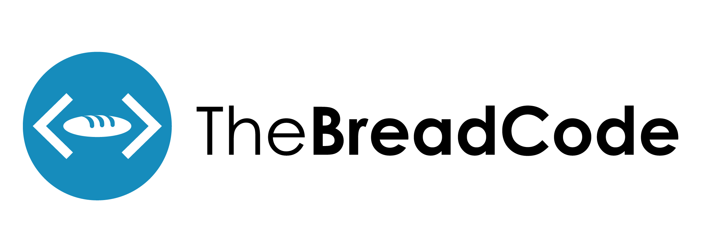

# The Bread Code Manifesto

Learn how to master the art of baking the programmer way.
If you love programming, you will also enjoy breaking some bread.
A/B test, iterate and ultimately become a self-taught baker.
This repository is dedicated to becoming your bread manifesto with
useful tricks and hacks. Furthermore, the goal is to illustrate
how easy making bread is and that you can get started
today without expensive tools.

This repository is still work in progress and will be updated continuously.
Feel free open up issues when facing problems. Pull-requests with custom
recipes are welcome too! Happy baking.

## Recipes with yeast

The basic recipe is the source recipe from which the customized recipes inherit.
I suggest starting baking the standard bread until you master it, and only then move on to further customizations.

* [Basic bread](basics/basic-dough.md)

Custom recipes:

* [Standard bread](recipes/savory/standard-bread.md)
* [French bread](recipes/savory/french-bread.md)
* [Date walnut bread](recipes/sweet/date-walnut-bread.md)
* [Portuguese inspired Broa corn bread](recipes/savory/portuguese-broa-corn-bread.md)
* [Linseed bread](recipes/savory/linseed-bread.md)
* [Bacon bread](recipes/savory/bacon-bread.md)
* [Salami bread](recipes/savory/salami-bread.md)
* [Saffron Goat Cheese bread](recipes/savory/saffron-goat-cheese.md)
* [Cocoa bread](recipes/sweet/cocoa-bread.md)
* [Full milk Chocolate bread](recipes/sweet/full-milk-chocolate-bread.md)

## Recipes with sourdough

Sourdough bread is an all natural bread without any added yeast.
The dough gives the bread an amazing, you guessed it, sour taste.
Any yeast bread can also be made with sourdough instead of yeast.

All of those recipes assume that you have made your own sourdough starter. The
process takes approximately 7 days to complete:

* [Make your own sourdough](basics/sourdough.md)

Once you have your sourdough starter you can proceed with the actual bake. The
below recipe is the standard recipe. All the other sourdough recipes customize
parts of this recipe.

* [Basic sourdough bread](basics/basic-sour-dough.md)

Custom Recipes:

* [Standard sourdough bread](recipes/sourdough/standard-sourdough-bread.md)
* [Golden standard German bread](recipes/sourdough/golden-standard-german-bread.md)
* [Bavarian rye bread](recipes/sourdough/bavarian-rye-bread.md)
* [Einkorn sourdough bread](recipes/sourdough/einkorn-sourdough-bread.md)
* [Emmer sourdough bread](recipes/sourdough/emmer-sourdough-bread.md)
* [The Crack Bread](recipes/sourdough/crack-bread-tomato-water.md)
* [Sourdough Pasta](recipes/sourdough/sourdough-pasta.md)

## Common Problems / FAQ

[See the guide Common problems / FAQ](basics/common-problems-faq.md) for strategies to deal with frequent pitfalls that arise when baking.

## Experiments

This section contains experiments where N breads are baked with only one
parameter change each. This helps to visualize what impact a change of a single 
parameter has on the final product. Feel free to submit your own experiments as a PR.
The more experiments there the merrier.

* [Einkorn vs. Emmer](experiments/einkorn-vs-emmer.md)
* [Scoring vertically vs. at an angle](experiments/scoring-vertically-vs-angle.md)
* [Proofing Sourdough at room temperature for 3 hours vs. 10 hours fridge](experiments/proofing-sourdough-3-hours-room-temperature-vs-10-hours-fridge.md)

## Tools

* [Which tools should you buy for baking?](basics/tools.md) Busting some of the tooling myths here. TLDR - you don't need any tools except a bowl and heat source.

## Motivation

Have you ever relished the taste of a fresh and warm bread with a crispy crust?
Do you know the sound of the crispy crust when you take a bite?
Have you ever experienced the delicious and homey scent of a bread coming right out of the oven?

When baking bread, you experience a whole variety of emotions and sensations.
Furthermore, you step into a world where simplicity can become very complex.
However, reaching perfection is amazing! The feeling of having crafted
a perfect combination of all natural ingredients is unique and so special.
I say “a perfect combination”, not “_the_ perfect combination” because
that is the secret. There is no such thing as the perfect bread.
There are so many different possibilities, combinations,
ingredients, parameters — every bread is unique!

Being a programmer myself, I lacked scientific resources on the internet.
In my daytime job, we use A/B testing for almost everything.
Why not apply the same proven methodologies to baking?

All the recipes I provide have been A/B tested by myself with different variations.
I encourage you to do the same. Try to recreate the same bread with only one
parameter changing at the time. That way you can iterate to find your personal
preferred bread combination. Make notes and log all the different types
bread you made. Slowly, bread by bread you will become better.

You will fail, in fact, you will fail often.
With every fail, ask yourself what you could have done better.
That's how I have learned and still learn with every bread I bake.
That's what I call `The Bread Code`. I hope this repository motivates people
around the world to try and become better bakers.

## Links

Follow us on Instagram: [https://instagram.com/the_bread_code](https://instagram.com/the_bread_code)
