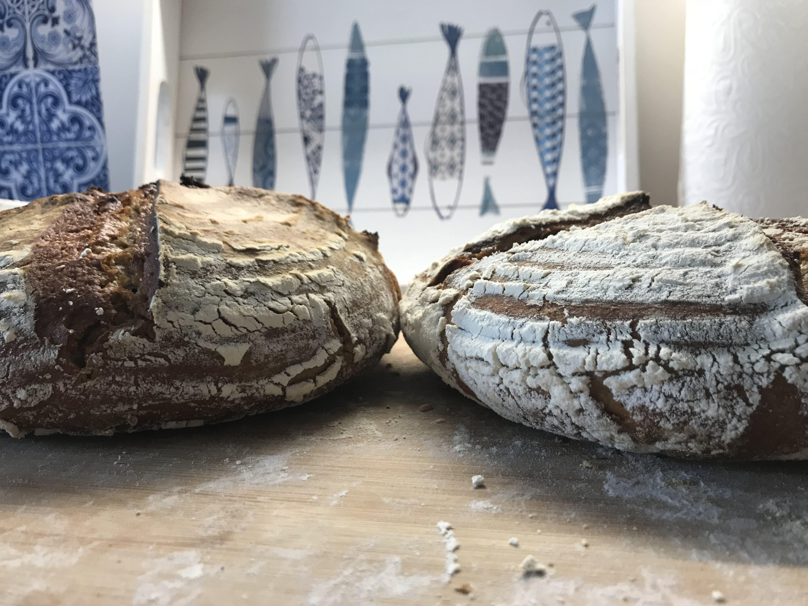

# The Basic Dough

Use this basic dough recipe as starter for all your upcoming breads.
Custom ingredients are added before the final shaping.
The basic formula always remains the same.

Always prepare the dough 24 hours before baking.
If you run out of time, you can also do this faster but then you will have to knead more initially.
In this case a KitchenAid or similar tool can be helpful, as it will speed up the process.

## Ingredients

- 500 grams of all-purpose flour (high protein). In Germany type 550.
- 375 grams of water or 75%. Experiment with more hydration as well.
- 10 grams of salt or 2%
- 5 grams of dry yeast or 1%

## Instructions

### Preparation steps

The default recipe does not require any preliminary steps.
Custom recipes hook in here with additional steps that are required to be done before starting the bake.

### Autolyse

Mix together all the ingredients listed by the recipe, except the yeast. Some recipes require
you to exclude ingredients initially. Instead they will be added later during
the shaping phase. Proceed and all the ingredients in large bowl in front of you.
Stir them with a spoon for 2 minutes.
Let the dough rest for an hour after this step to have the flour absorb the water.
Furthermore the atoms will homogenize and spread evenly throughout the dough.

### Add the yeast

Place the yeast evenly on top of your dough. Many sources claim this should be done after the autolysing.
However, when baking myself I sometimes add yeast right away and could not notice a significant difference.
It would be interesting to conduct more research on this topic.

You may see in other recipes that it is common to proof the yeast in warm water, followed by the addition of sugar to feed the yeast. This is only done to make the dough rise faster. Since we are waiting overnight for our dough to rise, the sugars and room temperature water are more than enough, no need to add sugar.

### Form the gluten

We need a very strong layer of gluten to trap air in the dough.
At the same time this will make the bread more crispy.
Bread with nicely formed gluten will not fall apart when cutting.

Knead the dough for around 5 minutes. This will also evenly distribute the yeast that we previously added.
There is no special technique to kneading, just imagine you want to punch the dough.
If the dough sticks too much to your hands, wet them in water.

Test whether your gluten is nicely formed by lifting the dough in the air with one hand.
The dough should slowly flow back to the bowl if it's good to go.

If it starts sticking together, you have your gluten.
Experiment on this step further in the future to form even stronger gluten connections.

Cover the dough with some foil or linen for 8 hours.
I usually go to bed and resume the next morning.

### Stretch and Fold Part 1

After 8 hours we will start stretching and folding the dough.
Don't worry if the dough collapses after the 8 hours.
The yeast will start its work again after this step.

The idea is to increase the strength of the gluten network even further.
Don't knead the dough too hard at this point. Be soft and gentle.

To stretch and fold, wet your hands and start pulling the dough upwards at one area of the bowl.
I start at the bottom and stretch it all the way to the top.
Assuming your bowl is northwards in front of you, you are standing south of the bowl.
Take the northern part of the dough and fold it on the south part of the dough.
Rotate the bowl by 90° and do the same. Do this in circles.
I tested different angles of rotation but made the best experience with 4 x 360° degree rotations.
As mentioned before, be soft and gentle at this point.

### Stretch and Fold Part 2

After another 10 hours (say, after work) do the same steps again you did in Stretch and Fold Part 1.
We will want to stretch and fold the dough one more time.
If you are at home, you can also stretch and fold the dough more often (though not more often than 1 hour apart).

### Shaping the dough

Directly after the last stretch and fold remove the dough from the tray and place it on a lightly floured surface.
Don't be scared of adding a little more flour at the start.
This way your dough won't stick that much.
In the long term, reduce the flour you use at this step. The more hydrated your dough is, the fluffier it will become when baked.

Stretch the dough apart a little to form a kind of pizza. It should be in a
round shape in front of you, not too flat. Only do this very softly. The
harder you press the dough the more gas will evaporate and the less fluffy
your ultimate bread will be.

### Recipe customization

This is where most of the other recipes hook in.
Once the dough is in front of you, you can start adding ingredients such as cheese, spinach, walnuts or whatever you want.
For starting, I suggest to not go with too many extras.

`{{ CUSTOMIZE_YOUR_RECIPE_HERE }}`

### Finalizing the shaping

In front of you you have the round dough. If you customized your recipe you might
now have added seeds, walnuts or anything else on top of the dough.

We need to create as much tension on the lower part of the dough facing the
bottom currently as possible. The lower part will be on top in the oven later
on. The more tension we have the better the dough raises in the oven upwards.
If you do not have enough tension, it will turn out like a pan cake. Do not
worry if this happens, it will still taste amazing.

So move the outer parts of the pizza inwards, to the center.
Piece by piece your dough will become rounder.

[See this video explaining how to do it.](https://www.youtube.com/watch?v=5--bR1mPiZE)

The trickiest part of the process starts now.
You want the bottom part of the dough that you have created to face upwards. The
currently lower side has a lot of tension after following this process.
Flip the dough so the lower part is not facing you directly.

Gently stretch the edges of the dough downwards a little. I use my hands to do that, like in the figure above.
The goal here is to create more tension on the surface.
This will support the dough in the oven and make it raise more.
If your bread ends up too flat, this is very likely the step that you need to improve.

### Place the dough in a clean bowl

If you have a [banneton](tools.md#banneton-optional) use a banneton; if not, use a clean bowl.
Place the shaped dough upside down in the container.
The round surface that you created should be now at the bottom of your banneton or bowl.
When baking the dough we will flip the bowl and the round surface will again be on top in the oven. Cover the bowl with linen or some foil.

Let the dough rest for an hour, or overnight in the fridge.

### Preheat the oven to maximum temperature

After 30 minutes of shaping the dough, preheat the oven to its maximum temperature, or about 270 degrees Celsius (520 Fahrenheit).
It will also takes another 30 minutes for the oven to reach max temperature.

Place a baking tray in the oven, and on the bottom, another tray filled with water.
This water will evaporate during baking, creating steam that supports the dough and allows it to rise it more in the oven.

### Finally bake the bread

After about 30 minutes of the oven pre-heating, remove the top tray and place your bread directly on it.
Be careful, as the tray will be as hot as your oven.
If you have a dutch oven, place the bread in it.

Score the bread with 2 cm deep cuts at an angle.
Consider these like tectonic plates, creating weaknesses in the surface to allow the bread to raise at the point of weakness.
If the scores are vertical, the bread will block it.
In comparison, if cut at an angle you can create the famed Bread Himalayas 😻.

Put the bread into the oven. Reduce the temperature to 230 degrees Celsius (450 Fahrenheit). Wait for 25 minutes.

### Remove (the tray with water or lid)

After 25 minutes remove the tray of water or the lid of the dutch oven, to allow the crust of the bread to become super crisp.
The bread no longer rises at this point. The yeast has been killed, the water evaporated. We use this time to really get it crispy.

After another 20 minutes in the oven your bread is ready to be enjoyed.

