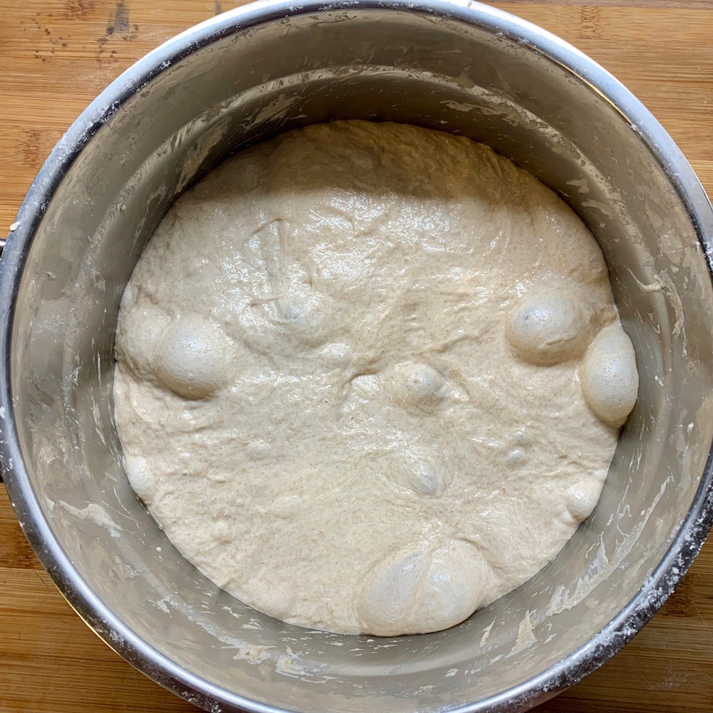

# The Basic Bread

Use this basic dough recipe as starter for all your upcoming breads.
You can optionally add custom ingredients direclty into the dough, or
during the final shaping.

The basic formula always remains the same for all the breads in this repository.

The recipe is aimed for people wanting to make the dough over night.
The recipe calls for several folds of the dough during the whole process,
but you can also skip them. The folds help but are not required.

## Ingredients

- 500 grams of bread, or all-purpose flour, the higher the protein the better
- 325 grams of water or 65%
- 10 grams of salt or 2%
- 1 gram of dry yeast or 0.5% or 3 grams of fresh yeast (1.5%)

Sidenote - if you are interested in learning about why we use bread or all purpose flour,
[have a look at this video](https://www.instagram.com/p/Bju7aazn27T/?hl=en),
explaining the gluten content in different flours.

## TLDR

1. Mix all ingredients together until you have a smooth silky dough
2. Wait until dough doubled in size (also known as bulk fermentation). This takes
  on average ~8 hours
3. Shape a dough ball
4. Place in baneton or in a floured bowl
5. Wait until almost doubled in size (also known as proofing). This takes on
average 2 hours at room temperature or 24 hours in the fridge
6. Bake 20 minutes in preheated oven at 230°C with a bowl of water
7. Remove bowl of water after 20 minutes, bake another 20 minutes
8. Baking is finished when bread has desired brown color

## Instructions

### Autolyse

Mix together all the ingredients listed by the recipe, except the yeast.
Mix everything with your hand until the ingredients have created a homongenous dough.
Make sure no flour ist left on the edges of your container.

Let the dough rest for an hour. This helps to create a gluten network that will
hold your dough together as well as allow your dough to become inflated
by the gas the yeast produces.

If you skip this step, you will have a much more challenging time when kneading it.
Just letting the dough rest an hour like this will do wonders.

### Add the yeast

Add the yeast to your dough. If we were baking a sourdough loaf, this is also the moment
where we would be adding the sourdough starter. Good news - mastering this recipe
makes it very easy to join the sourdough game.

Mix everything until the yeast is incorporated nicely and you have a smooth silky mass.

### Forming the gluten

We need a very strong layer of gluten to trap air in the dough.
The yeast will overtime inflate the balloon with gas.
The more gas we have inside of the dough, the more open and fluffier
the crumb will be. At the same time the bread will also expand
more in the oven, looking visually more appealing.

So go ahead and knead the dough for around 5 minutes.
This will also evenly distribute the yeast that we previously added.
There is no special technique to kneading, pull the dough and flap it
over itself. Or you can use the punch technique.

If the dough sticks too much to your hands, that is normal in the early stages.
At some point the dough will stick way less, because the gluten holds together better.

Test whether your gluten is nicely formed by lifting the dough in the air with one hand.
The dough should slowly flow back to the bowl if it's good to go.

Cover the dough with some foil or linen so it does not dry out.

I usually go to bed and resume the next morning.

### Stretch and Folds

This is typically how a bread looks like after the first fermentation phase (bulk fermentation). Compare this with your own results.

Perform a stretch and fold before removing the the dough from your container.

If you bake during the day, you can perform one stretch and fold every hour.
This will give you a better gluten network, but don't worry it is not required.

[A good video on how to properly fold is this one.](https://www.instagram.com/p/Bju7aazn27T/?hl=en)
The technique is called `coil folding`. Make sure you wet your hands with a
little bit of water before performing them. This makes the dough non stick to your hands.

### Shaping the dough

This is where all comes together. It takes a little bit to master shaping,
so don't worry if your bread does not look store-bought yet. It will come over time.
Regardless, the taste will be amazing.

Directly after the last stretch and fold remove the dough from the tray and
place it on a lightly floured surface. Don't be scared of adding a little more
flour at the start.  This way your dough won't stick that much.
In the long term, reduce the flour you use at this step. Less flour is better
because the dough sticks better to itself when it is wetter.
This means that it will glue together better and thus hold its shape better.

Stretch the dough apart a little to form a kind of pizza. It should be in a
round shape in front of you, not too flat. Only do this very softly. The
harder you press the dough the more gas will evaporate and the less fluffy
your ultimate bread will be.

We need to create as much tension on the lower part of the dough facing the
bottom currently as possible. The lower part will be on top in the oven later
on. The more tension we have the better the dough raises in the oven upwards.

So move the outer parts of the dough inwards, to the center.
Piece by piece your dough will become rounder.

[See this video explaining how to do it.](https://www.youtube.com/watch?v=5--bR1mPiZE)

The trickiest part of the process starts now.
You want the bottom part of the dough that you have created to face upwards. The
currently lower side has a lot of tension after following this process.
Flip the dough so the lower part is not facing you directly.

Gently stretch the edges of the dough downwards a little. I use my hands to do that, like in the figure above.
The goal here is to create more tension on the surface.
This will support the dough in the oven and make it raise more.
If your bread ends up too flat, this is very likely the step that you need to improve.

### Place the dough in a clean bowl

If you have a [banneton](tools.md#banneton-optional) use a banneton; if not, use a clean bowl.
Place the shaped dough upside down in the container.
The round surface that you created should be now at the bottom of your banneton or bowl.
When baking the dough we will flip the bowl and the round surface will again be
on top in the oven. Cover the bowl with linen or some foil.

This stage is now called proofing. The dough has to increase in size again
(30-70%). A good and easy way to have a consistent environment is to proof
the dough in the fridge for 24 hours in the fridge. If you proof at room
temperature make sure your dough passes the
[finger dent test.](https://www.youtube.com/watch?v=6oAfl1u0fIw)

If you have time, definitely go for the fridge. The dough will increase in size
just like it does at room temperature. It will take more time, yes. But at the same
time your dough is cold. The gas inside is cold as well. When heated up in the oven
your dough will expand much more in size. It's a great hack.

### Preheat the oven to maximum temperature

Preheat the oven to maximum temperature. Place your baking tray in the oven.
We want it to be as hot as possible. Without that your bottom of the bread will not be crispy.

Place another bowl with water at the bottom of the oven. This water will
evaporate during baking, creating steam that wettens the dough and helps it rise.
Without water, your dough becomes crispy right away.
It will not be able to expand properly.

### Finally bake the bread

After about 30 minutes of the oven pre-heating, remove the top tray and
place your bread directly on it.  Be careful, as the tray will be as
hot as your oven.  If you have a dutch oven, place the bread in it.

Take a knife and place a 1cm deep cut in the center of your loaf. Try doing
the cut at a 45° angle. Later on you can upgrade your scoring game and
attempt different techniques. They all change how the bread will rise
and how your final bread looks like.

Put the bread into the oven. Reduce the temperature to 230 degrees
Celsius (450 Fahrenheit). Wait for 25 minutes.

### Remove (the tray with water or lid)

After 25 minutes remove the tray of water or the lid of the dutch oven,
to allow the crust of the bread to become super crisp.
The bread no longer rises at this point. The yeast has been killed,
the water evaporated. We use this time to really get it crispy.

After another 20 minutes in the oven your bread should have a good golden crust.
If you like the bread to be crustier, bake it longer. This depends a lot on personal preference.

This is how one of my first ever breads looked like. Yours is probably going to look way better.

And here a bread 3 years later:

Wait 30 minutes until your bread cooled down. It is hard, but - you will not
tear the crumb apart. Enjoy with fresh salted butter or a little bit of olive oil. Congratulations, you mastered your first loaf!

If you feel something can be improved in this recipe - please open up a pull request.
