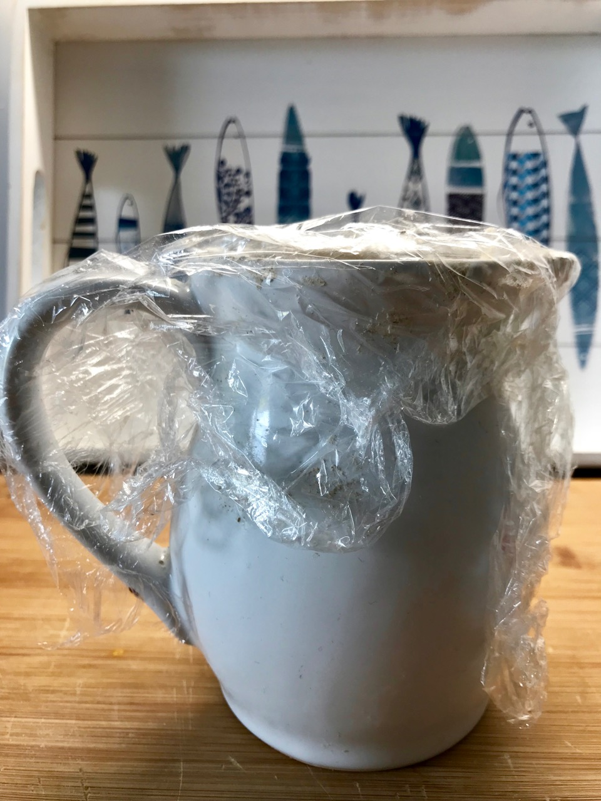
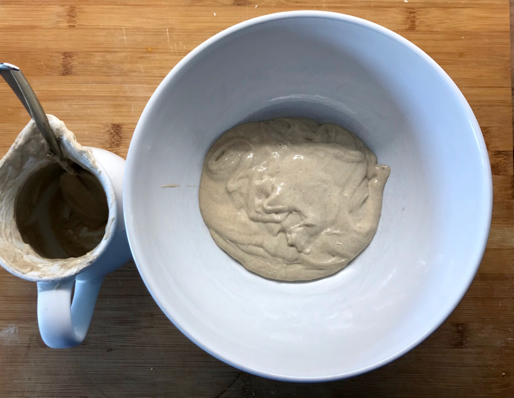
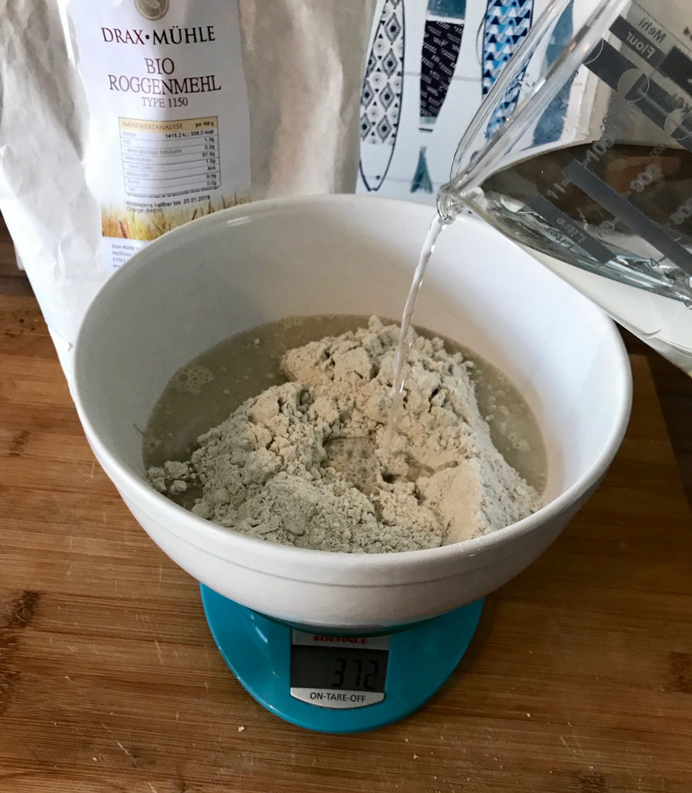
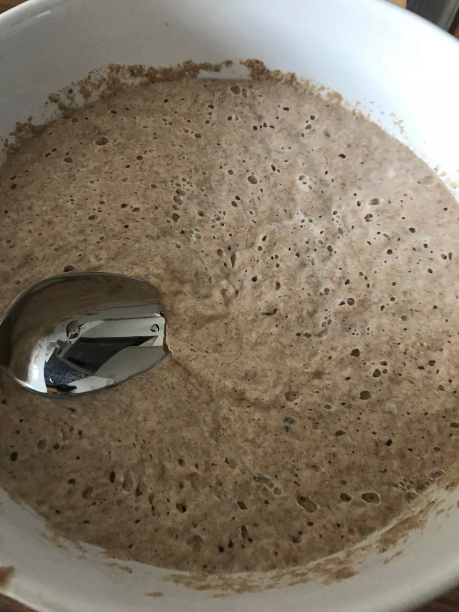
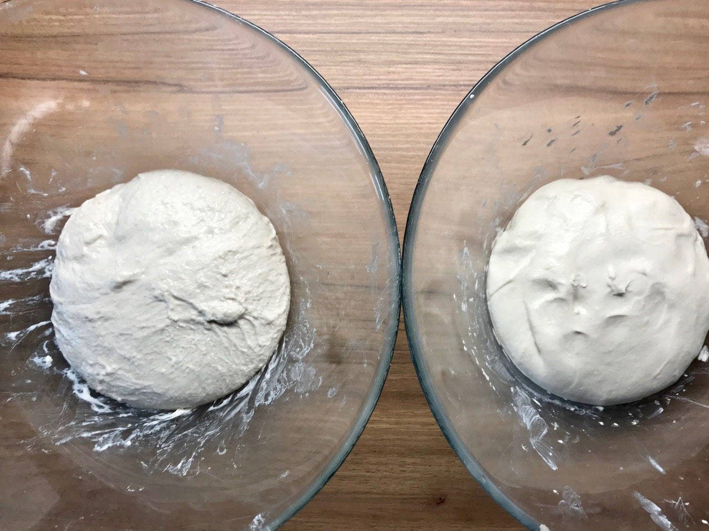
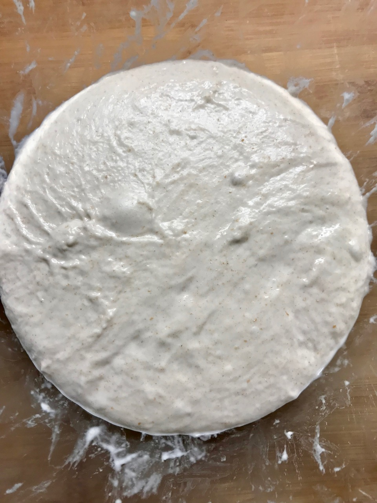

# The Basic Sourdough

Use this basic dough recipe as starter for all your upcoming sourdough breads.
It is very similar to the standard yeast bread recipe with one major
difference. Instead of using industrial yeast, we are using our own sour
dough. The bacteria and yeast will create all the gas to make the loaf nice
and fluffy.

Using sourdough instead of yeast creates nice sour taste
which creates a pleasant taste experience. The sourish taste comes from the bacteria
creating lactic acid. Sourdough converts your whole bread into something fully natural. A sourdough bread only contains flour, water and salt.
Bread has been baked like this for thousands of years.

As a side effect your bread will become much more resistant to mold. A sourdough bread
can still sometimes be eaten 3-4 weeks after the bake. In your sourdough bread
bacteria and yeast wage war on each other, blocking each other from taking over the bread.
In a yeast bread you do not have bacteria to counteract the yeast.
Thus the yeast bread turns inedible much faster.

Overall you can bake every yeast-bread with sourdough instead. You only have to consider
that your sourdough is at 100% hydration. Thus you need to adjust the hydration
level on the yeast bread you bake to compensate for the added hydration. This does not
work the way around though. You can not bake all the sourdough recipes
with yeast instead. Some flours such as rye require the sourdough to become
bake able. See the picture above for a comparison of how the final sourdough vs.
yeast bread looks like.

Other sourdough recipes in the manifesto inherit from this recipe. They override
a few sections with custom steps and or ingredients. The process regardless is
always the same across all the sourdough breads you will bake. Inspirational
ideas are provided as custom recipes in this repository. From a programming
perspective this recipe is an abstract class that you can't directly
bake. Please see the [standard sourdough bread recipe](../recipes/sourdough/standard-sourdough-bread.md)
for an actual recipe you can bake.

## Ingredients

- 500 grams of all-purpose flour. In Germany type 550. You can also use strong flour but working the dough becomes a little more difficult. The dough will be stickier. Thus for beginners go with all purpose flour.
- 325 grams of water or 65%. Experiment with more hydration as well.
- 200 grams or 40% of sourdough starter at 100% hydration.
- 12  grams of salt or 2% on the net flour amount. Example Calculation: 500 grams of flour plus 200 grams of sourdough starter (which has 100 grams of flour and 100 grams of water). One percent of 500 grams + 100 grams is 600 grams. Two percent are 12 grams.

If you do the math you will end up with 325 grams of water and another 100 grams of water
from the sourdough = 425 grams water in total. Then you have 500 grams of flour
plus another 100 grams from the sourdough starter. Which means you have a total of
600 grams of flour in your bread. With 425 grams of water you have a ratio of approximately
70% hydration in the dough. This is less than on the simple yeast bread.
However since you utilize strong or full grain flour for your sourdough baking
becomes more difficult. The dough is much stickier and harder to handle. Thus the combination
of 40% sourdough on the flour creates an excellent bread which is not too hard to handle.

## Instructions

### Preparation steps

8 hours before you start the bake remove the [mother sour dough](sourdough.md) from your fridge.

The dough is feeling kind of cold and freezing. Even worse - your dough is hungry!
Do you hear the bacteria and yeast asking for food?

Our goal is to make the dough feel nice again. However - bad luck. For the dough,
not the whole dough will be fed, only parts of it. Sometimes I feel bad for the
other unlucky part that is unlucky, left in the cold and will receive no food.
We always feed equal amounts of flour and water to our mother dough just like
we did when we initially grew our mother dough.

We need 200 grams of sourdough for the recipe. Since we do not want to use our
full mother dough we start feeding parts of the mother dough with new flour.
Some of the mother dough is always left in the fridge for the next bake.
Also it could be that the feeding goes bad and you have to throw away your
newly fed dough. Realistic example - your cat ate the whole sourdough. What
now? You have to wait another 7 days to make your next batch of sourdough!

Anyways - 200 grams of sourdough are needed for the bake. We will use 100
grams of our mother sourdough and 100 grams of feeding. Things become a little
complex here. Your mother dough is really hungry and will convert approximately
5 percent of the dough into gas. For that reason we will always make 5% more
than we actually need. At the same time 100 grams of mother dough need to go
back to the fridge. Else we would end up consuming our mother dough until we
have none left! So what we need to calculate is 200 grams for the recipe and
100 grams back to mommy. Add another 5 percent because the yeast and bacteria
are super hungry.

*Step 1:* In a large bowl in front of you place 100 grams of mother dough.

*Step 2:* Add 105 grams of full grain or strong flour.

*Step 3:* Add 105 grams of warm water.

You will end up having 310 grams of sourdough starter in
front of you, the so called _starter dough_.

*Step 4:* Stir everything nicely together. You should end up with a homogeneous
dough in front of you.

If you have less than 8 hours until your bake, you can use
slightly warmer water. That will re-activate your starter dough faster. However
I usually mix everything together the evening before I want to bake. Over
night everything is ready.

This is how your starter should look the next morning. Notice all the
bubbles that are in the starter. I used rye to feed my starter. But you can
use any other strong flour that you have available. I tested all purpose flour
but the starter dough turned too sour too fast.

### Autolyse

In a new, large bowl mix 500 grams of flour with 325 grams of water and 12 grams of salt. This is our _basic dough_.
Stir it with a spoon for 2 minutes. Let the basic dough rest for an hour after.
This step is to have the flour absorb the water. Furthermore the atoms will
homogenize and spread evenly throughout the dough. This will already
give you basic gluten structures. The gluten structure keeps the gas inside of the dough.

### Add the starter dough

Place the 200 grams starter dough evenly on top of your basic dough. Many sources claim this
should be done after the autolysing. However, when baking myself, I sometimes add
the starter dough right away and could not notice a significant difference so far. I
just follow this best practice and it works. It bothers me a little that I
have not fully tested this myself yet. It would be really good to conduct more
research here with a couple of A/B tests.

### Give back to the mother dough

We removed 200 grams of dough from our mother dough in the very beginning.
Return the rest of what is left from our starter dough to our mother dough.
Place the mother though container in the fridge and
cover it afterwards. We will re-use the mother dough on the next bake again. This way
people sometimes have a 100 year old sour dough. They always return parts back
to their original mother dough.

### Knead the dough

Now that we mixed everything together it is time to develop the gluten. For that we
simply start kneading the dough. Place it in front of you on a lightly
floured surface and knead it. You can also simply knead it within the bowl.
There is no special kneading technique. Imagine the dough is
someone you do not like. You want to squeeze that person out. That's how you
do the kneading. Do this for around 10 minutes. If you have a dough kneading
machine, use that one instead.

On the left hand side you can see my sour dough fed dough after the initial kneading. On
the right hand side I A/B tested a dough with yeast instead.

### Let the gluten form

We will let the dough rest covered in a bowl for around 4 hours. During that
time the starter dough's yeast will spread even more throughout the other dough
ingredients. You can also prolong this step. The result will be a more sour
taste as the bacteria produces more lactic acid. Feel free to experiment on
the duration. After 4 hours your dough should already have increased in size.
Some bubbles should be seeable. This means the yeast starting njamnjam on the
dough and released gas. If the dough did not raise after 4 hours just wait
another X hours until this happened. It can happen that your mother dough is
not as reactive as mine. There is different yeast and bacteria even across
villages next to each other. In Germany villages sometimes trade the sourdough
between each other for baking.

You can already see bubbles forming in the dough above. That is how mine looked like after 60 minutes.

### Shape the dough

After the gluten-forming period we will proceed and shape the dough. Don't
worry, the dough will collapse. That is natural. Experiment here with less kneading when shaping so more gas remains within the dough.
That way for instance air bubbles will be significantly larger in the final bread.

Follow the steps for shaping exactly (one exception) as [described in the basic dough recipe](basic-dough.md#shaping-the-dough).
Flour the surface slightly more as the sourdough is a little more sticky. That
will help you a lot with shaping on your initial bakes. Reduce the amount of
flour later on. The less flour you add here, the more fluffy your bread
becomes. Do not worry too much about this at the start.

### Recipe customization

[Follow the steps of the basic dough. It is the same for your sourdough.](basic-dough.md#recipe-customization)

### Finalizing the shaping

[Follow the steps of the basic dough. It is the same for your sourdough.](basic-dough.md#finalizing-the-shaping)

### Place the dough in a clean bowl

[Follow the steps of the basic dough. It is the same for your sourdough.](basic-dough.md#place-the-dough-in-a-clean-bowl)

### Preheat the oven to maximum temperature

[Follow the steps of the basic dough. It is the same for your sourdough.](basic-dough.md#preheat-the-oven-to-maximum-temperature)

### Finally bake the bread

[Follow the steps of the basic dough. It is the same for your sourdough.](basic-dough.md#finally-bake-the-bread)

### Remove (the tray with water or lid)

[Follow the steps of the basic dough. It is the same for your sourdough.](basic-dough.md#remove-the-tray-with-water-or-lid)

Done!

The above is an implementation of this recipe. It is the [most common sourdough
bread eaten in Germany](../recipes/sourdough/golden-standard-german-bread.md)
