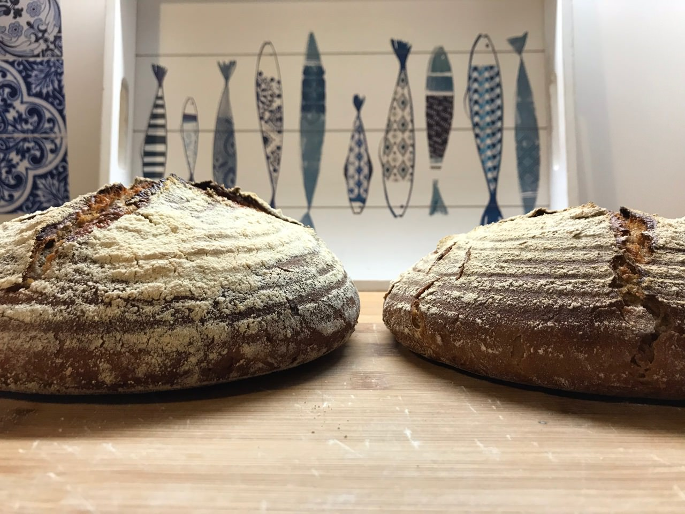

# Common Problems (FAQ)

This is a list of frequent questions/problems together with possible
solutions how to react. Since every dough and every oven is different
there is no perfect recipe.

You will need to experiment and learn. You will face a couple of pitfalls
and then double check with this list.

Make sure that you always only change 1 parameter at the same time.
That way you can iterate and learn how each parameter influences the final product.

#### There is liquid gathering on top of my sourdough starter when making it

That is no problem. This happens. Yeast and bacteria like a moist environment.

With higher initial hydration the yeast and bacteria can homogenize
better throughout the dough that you are making.
Since you are making the starter without any cover for the first days,
this is totally fine. Just make sure to thoroughly stir the flour and water in
the next time you feed the starter.
We are adding equal amounts of water and flour on all the subsequent days.
That way our initial 200% hydration will slowly decrease.
At the same time the dough will dry out a little bit, further decreasing hydration.
Ultimately you should aim for around 50% hydration in your sourdough starter.

#### When making the starter parts in the bowl dry out

Don't worry. Just keep stirring and ignore the dried-out parts.
Every part of the dough, even if dry, contains precious yeast and bacteria.
Just keep going it until your starter is ready.
The bowl might look like a mess, but that is fine. Even if parts of the dry
dough make it into the starter, that is no problem at all.

#### My sourdough already looks ready after 4 days

That can happen. It might be that there is more yeast and bacteria
in your surrounding. You might also have stored the bowl in a warmer
environment, providing a better way for the bacteria and yeast to grow.
Try the starter, it should taste really sour.
If it only tastes lightly sour then keep going.

If the starter passes your taste test you can also simply start baking your first bread.
For that extract some parts of your mother dough and proceed
with your recipe. In this case you can directly take the mother
dough and mix it with the flour. Normally you always want to feed
your mother dough before using it for the bake.
However in this case as you should have significant amounts
of mother dough, taking 100 grams should not be an issue.

#### What is the best ratio of sourdough and flour when baking?

When I bake sourdough breads I usually use 40% sourdough, so in case I
would use 100 grams of flour I would add 40 grams of sourdough.
The more sourdough you add, the more sour your bread becomes.
At the same time you will have more yeast releasing gas.
That means your bread will become fluffier with more sourdough.
Some people like their bread a little sourer than others.
You also need to consider for how long you will let the dough rest before baking.
In that time the yeast/bacteria will feast on the flour, releasing the
gas as well as the lactic acids.
I suggest to play with the 40%, do a couple of A/B tests to see which percentage you prefer.

#### How long does it take to feed the mother dough before baking?

Let's say it's Friday and you want to bake a bread on Saturday.
A good amount of flour for a regular sourdough bake is around
400 grams. That will give you a really nice loaf.
We aim for a 40% sourdough flour mixture. Which means we will
need 160 grams of sourdough inside of our dough. Take out a
large bowl and mix 100 grams of your mother dough with 50
grams of water and flour. That way you have 200 grams of sourdough.

#### When feeding the dough, what temperature should the water have?

It depends on how fast you want the sourdough to be ready.
Ultimately the water inside of your mother dough
will cool down or heat up to match its surrounding temperature.
Cold water will slow down the microbiological activity,
while warmer water will fuel yest and bacteria activity and have them working faster.
If you only have little time until you want to start baking,
use warmer water of 25 degrees Celsius.
If you have all the time in the world and can bake the next day,
use colder water of 15 degrees Celsius.

It would be nice here to analyze what impact different
temperatures have on the final taste.

#### After a few weeks of not feeding, liquid starts to appear on top of the mother dough

This is natural.
The yeast and bacteria have produced a lot of lactic acid and alcohol.
Just remove the liquid and start feeding your dough again,
as too much alcohol could result in your mother dough dying.
Periods of 3 weeks can easily be survived by your mother dough.

#### At which temperature should I store the mother dough?

The temperature impacts on how long it takes until your mother
dough is ready for baking. If you can wait for 7 days, store
the dough somewhere in your kitchen. If you store the mother dough
in a warmer environment it will be ready faster for baking. A temperature
of around 18-25 degrees Celsius is advised. It would be really
interesting to test whether a temperature
of below 15 still allows for the mother dough to grow.
Similarly very humid/super hot areas need exploring.

#### I have a wheat starter but want to make a rye bread

You can feed your starter any flour you like. You can just proceed and feed
the rye to your wheat starter. That is totally fine.

#### I have a rye stater and want to make a wheat bread

You can feed the rye starter wheat as well. It doesn't make a
difference. However when baking rye bread you will experience
a much stickier dough. You might have to use
more flour while shaping the dough. 10% rye inside of
your dough creates an additional flavor.

#### What is the best temperature to bake the bread?

A temperature of around 230 degrees Celsius is a good strategy to have
a nice crust and at the same time fluffy bread.

If the temperature is too high it could happen that your
crust will be too big. At the same time the interior
might not be baked yet. If the temperature is too low
your crust won't be as nice and crispy.

#### My bread does not rise properly in the oven

This is a common problem and can have many issues. A few
slight errors during the initial bake could have caused this. Let's investigate:

If you used yeast, it could happen that your yeast was simply dead.
This happens to me on around every 20th bake.
I need 5 grams of yeast for the bake.
The pack of dry yeast contains 7 grams.
What I do is take the 2 grams that I do 
not need and place them in a bowl with warm sugary water.
After 2 hours the water should have become a little
bit bubbly. If not - then likely your yeast is dead.

Another option could be that your shaping before baking is not done right.
You want the bread to rise upwards in the oven, not to the left or right.
To achieve that your shaping has to be done properly.
You want to create tension on the surface of the dough. The moment you
add a small crack to the surface the dough will naturally rise upwards
not to the left or to the right.
[This is a good video tutorial on shaping your dough.](https://youtu.be/5--bR1mPiZE).
The dough shaped in that video has 70% hydration.
The more hydration you add the more difficult this becomes. With more hydration
I find it very hard to ensure the bread does not turn out flat in the oven.
Practice the shaping, this is the hardest part about baking.
It will take a while to learn this.

**Did you score your bread when placing it in the oven?**
Scoring creates a weak spot in the surface.
That way your dough can rise upwards in the oven.
The way you score your bread is also important.
Score the top of the bread with cuts at an angle.
Imagine two plates on top of each other.
If you cut them vertically they might block each other.
But when scoring at an angle they are not blocked and can rise more.

**How humid is your oven when baking the bread?** If you have no humidity your
crust can form too fast. That way the bread is not able to rise properly.
You can either use a dutch oven, or a bowl with hot water.
Boil the water before placing it in the oven for maximum steaminess.
Remove the water  at 50% of the bake to have a nice crust regardless.

**How do you place the bread in the oven?** At this stage you want
to make sure that your dough does not lose any air at all when
moving the dough to the oven. When using a dutch oven place the
banneton/bowl on the lid of the dutch oven. Turn everything upside down.
The dough should drop nicely from the banneton. When just using a
baking tray do the same. Place the tray on top of your banneton
and turn everything upside down again.

**Make sure the bread does not stick to the bowl/banneton when baking.**
If the bread sticks to it you will create weak spots in places of you
dough where you do not want them. Instead of the dough rising upwards,
it will rise towards the weak spots that you created. If the weak spots
are on the side, it will just increase in size horizontally instead of vertically.

#### The interior of my yeast bread is somewhat hard and not fluffy

Did you add all the ingredients described in the recipe? This can
happen if you forget the sourdough or the yeast. If you are sure
you added all the ingredients it could be that the yeast or sourdough
was dead and thus did not create the additional gas that you
need to make the bread fluffy. This can also happen if you baked the
bread at a too high temperature. If the dough was somewhat flat in
the oven the surface gets in contact with
much more heat.

#### My sourdough bread dough does not increase in size after a few hour

Did you feed parts of your mother dough before mixing all the
ingredients? This is usually the case when the sourdough
does not have enough nutrition available. A good suggested
ratio of sourdough and flour is around 40%. Feed your mother
dough in the evening before baking. In the morning it will be
ready for mixing it with the other flour. With sourdough you
should be able to see a good increase in size after around 3 hours.
Double check that the temperature is right where you store the dough.
It should be not too warm and not too cold.

#### The crust is too thick on my bread

Did you steam the oven while baking for the first half?
We want to create a dough sauna initially. That way the crust
does not develop. Remove the tray of water after the first
half of baking. Make sure the water tray is
cooking inside of the oven. Try heating the water in a water
cooker before placing it in the tray. Experiment
what happens with the crust if you steam the oven the full time.
Then you should have the smallest crust possible.

Double check that your temperature is correct. It could be that
your oven just has more power than others. This happens
as the temperatures are never 100% the same between ovens.
Reduce the temperature if the steaming strategy did not work.

#### My crust is too little on my bread

Make sure you remove the steam source after half the bake.
You can also remove it earlier to have a nicer crust developed.
If you use a dutch oven make sure to remove the lid after half
the baking time.

#### When shaping the dough the dough always sticks to my hands

Dip your hands in cold wet water. Then try working the dough.
Repeat this the moment the dough starts sticking again.
If it started to stick once it will only get worse.
Clean your hands and start again from the start.

#### When shaping the dough the dough sticks on the surface

Make sure you lightly flour the surface on which you will
shape the dough. If it is too sticky, add more flour. It's better
to have a little bit too much flour than a huge frustration.
If your technique worked try reducing the flour on the surface
for subsequent bakes.

#### Guests are arriving in 2 hours and I want to offer bread

What makes the bread fluffy is the activity of the yeast releasing carbon dioxide.
You can speed up the whole process by giving the yeast food they like.
Simply add 5% sugar to your dough.
The yeast will become active like a critical nuclear reactor.
Normally the gluten network forms automatically over time.
Since you have no time you have to heavily knead the dough.
I would knead 15 minutes by hand or 10 minutes by machine, if you have one.
Turn on the oven already. Shape the dough and place it inside of a bowl for 30 minutes.
After 30 minutes place the dough inside the oven and bake as usual.

#### My bread looks like a pancake in the oven

Probably you did not shape your dough properly. See the tips
in this FAQ on making the dough rise more in the oven.

#### I forgot to measure the times when is my bread ready?

The moment the crust is turning nice and brown.
If you cut the bread which you should have done then some edges
of the crust can be a little black.
There is still debate going on whether acrylamides are dangerous
for humans or not. `TODO` - add some sources.

Another test to conduct is that your bread should sound hollow from the inside
when knocking on the bread. When it is hollow it means the dough created
bubbles and the sound can freely pass through the inside.

You can also use a thermometer and measure the temperature
inside of the bread. Make sure you stick the thermometer right
in the center of the dough at the thickest part. That's the part
which takes the longest to fully bake.
It's ready to be removed from the oven at 95 degrees Celsius.

#### What is a good ratio of salt in the bread?

1-3% salt on the total amount of flour will create flavor and not taste
too salty. Salt is very important to create flavor, it acts as natural
flavor enhancer. I usually go with 2% salt. If you make sourdough calculate
the percentage based on the total dough you will bake.
Let's say you have 400 grams of dough and 160 grams of sourdough,
calculate 2% of 560 grams. In total that is 11.20 grams of salt that you should add.

#### How important is kneading?

If you have time, you do not have to knead your dough.
The only goal of the kneading is to homogenize your ingredients
and allow gluten to develop. This will naturally happen over time
without kneading. If you want to bake fast because you have a time
restriction, kneading is the way to go.

#### How long should I wait before the actual bake?

At least an hour. If you have sourdough which is not as reactive
as yeasty dough you might have to wait a little longer after shaping.
While resting the dough should increase by another 20-30% in size.
To test whether the dough is ready for the bake, press your finger
into the dough slightly. Remove your finger. The dough should rise on
the spot you created. If the dough collapses you waited too long.

#### Why are there expensive bread baking machines if this guide suggests to do all manually?

Generally kitchen tools are usually only good if they do one function at the time.
Dough kneading machines for instance are excellent.
Machines that can knead, steam, shape and ultimately bake likely can not
do any of the steps very well. `TODO` a 1:1 comparison with the same
flour and hydration would be excellent.

#### My bread does not have any nice air bubbles inside. How can I achieve that?

The higher hydration the more bubbles your dough has.
You should bake with at least 70% hydration.
Make sure that you develop the gluten nicely.
That way none of the gas the yeast produces can escape.
You might want to knead your dough a little more initially as
this creates a stronger gluten network as well.
Do more stretch and folds until the final shaping.
If I have time I do this on an hourly basis on baking day.

#### What is the ideal hydration for the bake?

The higher the hydration the fluffier your bread becomes.
This comes at a cost of making it more difficult to work the dough.
The dough will stick more to your hands. At the same time the bread might
look a little flat in the oven. 70% is a good hydration to aim for when baking.
It is a good combination for maximum fluffiness and easy to work dough.
Definitely adjust this parameter on future bakes to see which bread
you like the most.

#### What should I use to cover my dough while it rests?

It can be plastic wrap, a towel, aluminum foil or anything else that prevents
your dough from drying out. Make sure that still some air circulation can happen.
You still want oxygen to enter your bowl while allowing excessive carbon dioxide to
evaporate.

#### How should I score my bread?

You want to create a weak spot the center of the surface. That way the
dough will rise upwards in the oven. A large X creates a nice pattern
and creates the weak spot right in the center. If you score the bread too
far on the sides then your dough will spread like a pan cake.
Make sure you do the cuts at an angle, not vertical.

The left bread was scored at an angle. The right one vertically.

#### How do I re-heat my bread?

The bread tastes the best after the initial bake. Sometimes however you might
want to bake and enjoy the bread later. Usually what happens is that the crust
becomes too crispy when re-heating in the oven. This happens because the bread
becomes too dry, thus the crust becomes bigger and bigger with every minute.
You might end up with a yummy stone.

Place a large tray in the oven with boiling water. Heat the bread at a lower
temperature of 150 degrees. The steam prevents the crust from becoming too
thick. It's almost as good as after the first bake.
