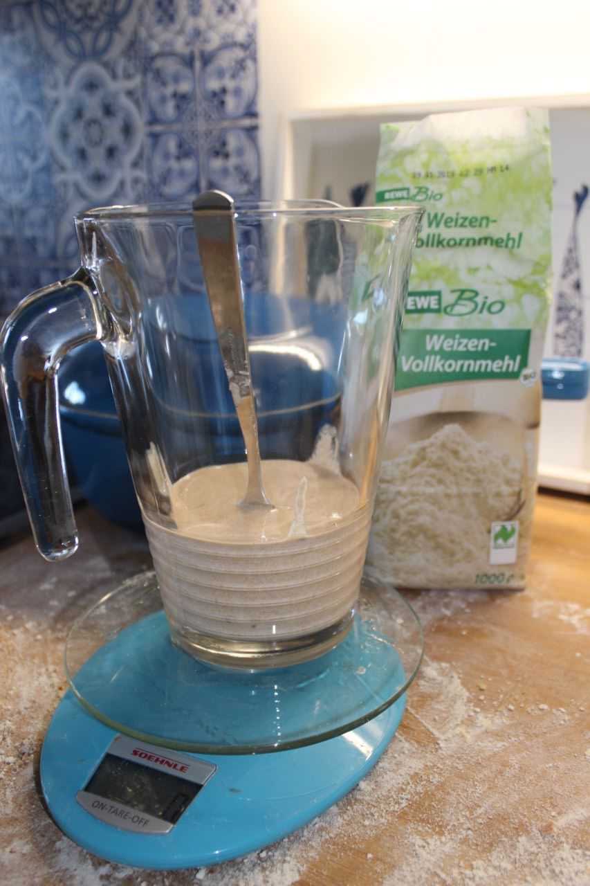
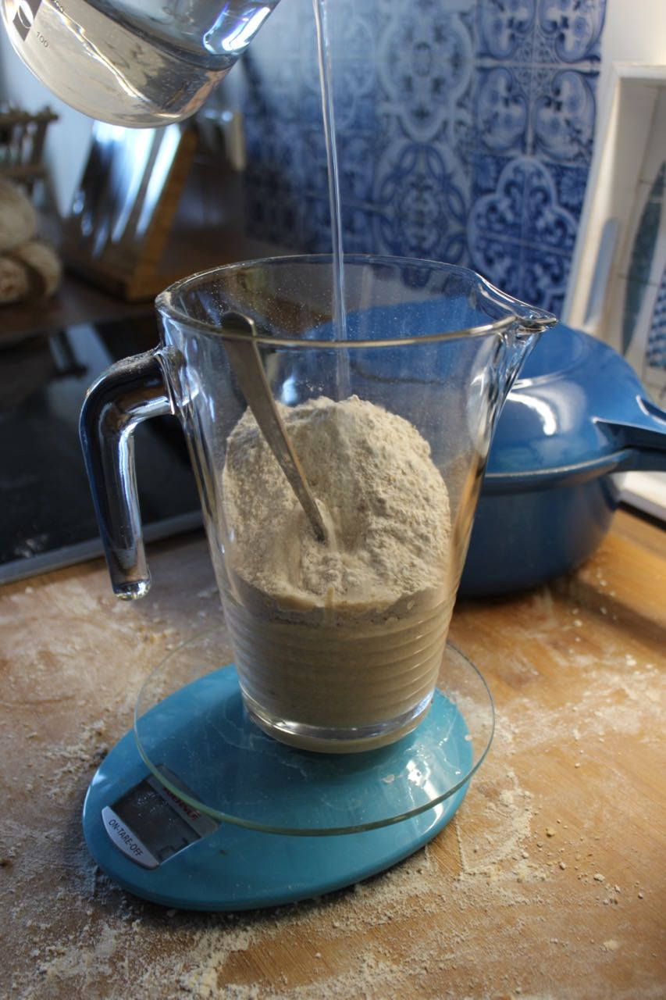
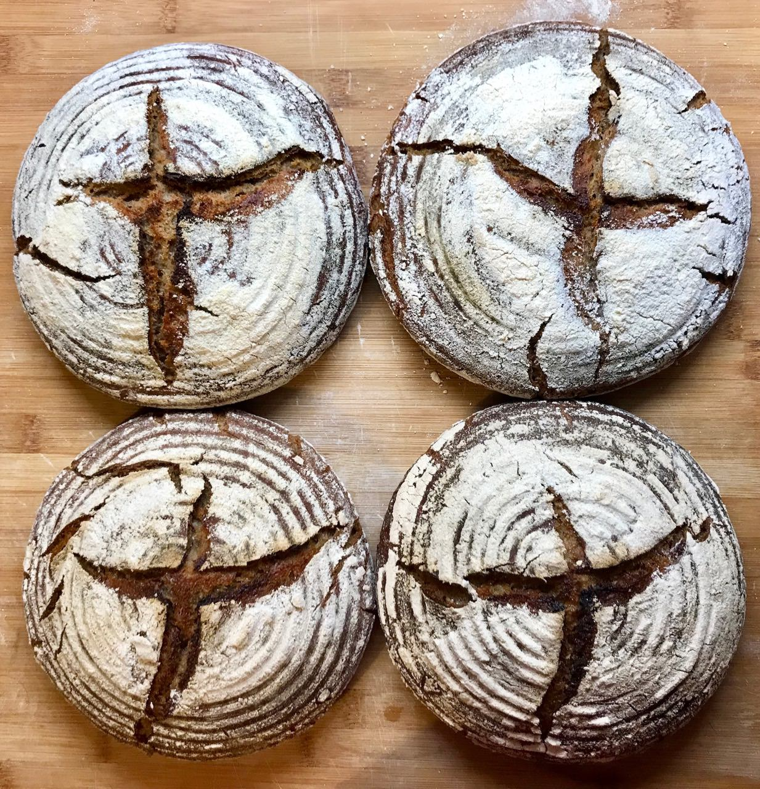

# Make your own sourdough

Sourdough is an excellent way to add air into your dough. At the same time the taste becomes a little sour adding excellent flavor to the bread. A welcome side effect is that you can eat your bread for a longer period of time as it does not catch mold as fast as yeast-only bread. [This is because of the antibiotic ingredients.](http://news.bbc.co.uk/2/hi/science/nature/881477.stm) Good news, it is really easy to make your own sourdough.

Personally I find sourdough amazing as it is an all natural product. It has been there for thousands of years. Mankind uses fermentation for many great products, wine, beer, sauerkraut and sourdough. It requires a little time initially to create your own sourdough, but afterwards you can re-use the sourdough for every future bake.

Before there has been artificial yeast there was already bread. In order to be able to turn flour into something enjoyable, mankind developed sourdough.
Without sourdough your bread would have looked and tasted like a big brick.

Have you ever wondered why at some point your food suddenly starts having mold all around?
It's because there is natural yeast and other bacteria in the air.
All sourdough does is trap this natural yeast and bacteria. The bacteria releases lactic acid when digesting the flour, and the yeast is in charge of creating the carbon dioxide which makes the bread fluffy.
The dough gives the bacteria and yeast a really amazing place to live, and they live in harmony and balance.
As a baker, it is your job to ensure that they feel happy and enjoy their home.

The quantities of yeast and bacteria in the air is minimal and thus it takes some time to gather large quantities in your dough.
That's why your first sourdough can take up to a week until significant yeast/bacteria has entered your dough and reproduced.

The whole process will take you 7 days with around 2 minutes of time per day.
That means you will spend only 14 minutes in total to have your own sourdough ready.
I like to call this dough the mother dough, as it is the mother of all my doughs.

## Requirements

* 400 grams of full grain wheat flour (Look for flour with Whole in the word like Wholemeal or Wholegrain)
* You can also take rye, spelt or whatever full grain flour you have available.
  Don't worry too much, you can later on feed your mother dough with rye to make it more ryish.
  It's just about getting a nice and yummy place for the bacteria and yeast.

## Instructions

### Day 1

Take a big bowl and add exactly 200 grams of water and 100 grams of flour.
Make sure you stir everything nicely. You want a homogeneous mixture of dough and water.
The water you use daily should always be between 20° and 30° degrees Celsius, as that is the ideal temperature for the yeast and the bacteria.
If you want to take it slower while baking, you can use colder water in the future.
This slows down the whole process.

Place the bowl somewhere in your kitchen, don't cover it.
We want the maximum amount of air to get into contact with your dough, to invite all the good bacteria and yeast to feast.
The temperature of the room where you store the dough does not matter too much.
It should not be freezing, and not super warm.
If it is colder it might take a little longer to get the mother dough ready.
If it is warmer, it could be done sooner.
Regardless, just stick to the 7 day strategy and you will be fine.

### Day 2

Add another 50 grams of flour and 50 grams of warm water. Stir everything.

### Day 3

Add another 50 grams of flour and 50 grams of water. Stir everything.

### Day 4

Add another 50 grams of flour and 50 grams of water. Stir everything.

### Day 5

Add another 50 grams of flour and 50 grams of water. Stir everything.

From this point on we will start covering the dough with a kitchen towel or foil.
Don't seal the bowl completely; just place it lightly on top. That way the dough does not dry out as much.

### Day 6

Add another 50 grams of flour and 50 grams of water. Stir everything. Cover the bowl again.

### Day 7

Add another 50 grams of flour and 50 grams of water. Stir everything. Cover the bowl again.

### Day 8

You are done 🎉. You are ready to bake your first bread with your own sourdough.
When not needing the mother dough, cover it with some foil and place it in your fridge.
This slows down the bacteria and yeasts' activity.
Unless you want to start baking now, place the sourdough in the fridge.

## Baking

A healthy formula is 40% sourdough for a rye bread/full grain bread.
Assuming you would bake 500 grams of flour, you will need 200 grams of sourdough.
The breads on the above picture have been baked with that ratio.

Remove the mother dough from your fridge. Take 200 grams of your mother dough and place it in a large bowl in front of you.
Since we stole 200 grams of mother dough, we need to return the same amount later on, or else the mother dough will be very unhappy.
Just taking without returning would result in you eventually having to start your sourdough again from scratch.
We need to return 200 grams of dough to the mother and we need another 200 grams of sourdough for our baking.
We already have 200 grams in the bowl in front of us, which means we need to produce another 200 grams of sourdough.

Simply add another 105 grams of flour (rye, spelt, full-grain) to the bowl in front of you, and another 105 grams of water.

You might now be thinking why 105 grams and not 100 grams? This is why large scale bakeries use baking powder instead of yeast/sourdough.
The mother dough eats around 5% of the dough and converts it into gas.
So just to be on the safe side always add a little more back to the dough than you take.
It's really easy, always add flour/water in 1:1 ratio.

If your mother dough came from the fridge, it will take some time to warm it up.
The bacteria yeast is still somewhat frozen and needs time.
I usually feed the dough 8 hours before I start to bake.
Usually I do this in the evening, go to bed and then start the real bake in the morning.

After 8 hours your new mother dough is ready to be used. Return 210 grams to your old mother dough in the fridge and stir the old mother dough with the newly added 210 grams of dough. Cover the mother dough again and place it in your fridge for the next week.

You can maintain your mother dough for a very long time. [There has recently been a report on a woman having a 122 year old sourdough starter.](http://trib.com/news/state-and-regional/newcastle-woman-maintains--year-old-sourdough-starter/article_000fcb17-5a5a-5590-84c2-3b55bb1d80fa.html)

After returning your mother dough to the fridge the actual baking starts. Mix the rest of the mother dough in front of you with the flours you want to use for baking your bread. Detailed recipes and suggested mixtures will follow. All of them follow this simple principle:

1. Take some of your mother dough from the fridge.
2. Feed the taken dough with 1:1 flour/water.
3. Wait for 8 hours.
4. Return what you extracted +5% back to the fridge.
5. Start the bake.

Below is what many first ever baked sourdough bread looked like. If yours looks somewhat like this, you did a good job. It was a mixture of 50% rye and 50% full grain.

This is what it looked like from the inside:

If you don't feed your mother dough it will eventually starve as it has no more food. Don't worry, my mother dough survived for 4 weeks in the fridge.
You are not forced to bake every weekend.
Some liquid may gather on top of your mother dough, that's usually lactic acid and a good amount of alcohol. Just remove that, feed your dough again and you should be good.
