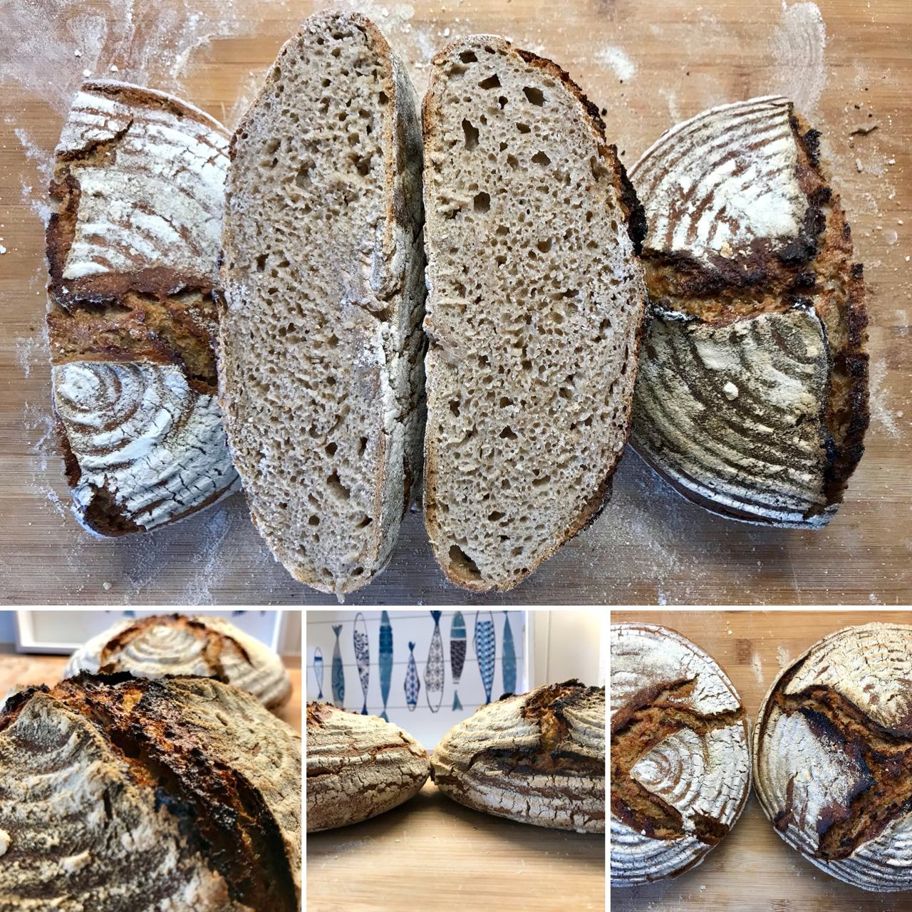

# Make your own sourdough

Sourdough is an excellent way to add air into your dough. At the same time the taste becomes a little sour adding excellent flavor to the bread. A welcome side effect is that you can eat your bread for a longer period of time as it does not catch mold as fast as yeast-only bread. [This is because of the antibiotic ingredients.](http://news.bbc.co.uk/2/hi/science/nature/881477.stm) Good news, it is really easy to make your own sourdough.

Personally I find sourdough amazing as it is an all natural product. It has been there for thousands of years. Mankind uses fermentation for many great products, wine, beer, sauerkraut and sourdough. It requires a little time initially to create your own sourdough, but afterwards you can re-use the sourdough for every future bake.

Before there has been artificial yeast there was already bread. In order to be able to turn flour into something enjoyable, mankind developed sourdough.
Without sourdough your bread would have looked and tasted like a big brick.

Have you ever wondered why at some point your food suddenly starts having mold all around?
It's because there is natural yeast and other bacteria in the air.
All sourdough does is trap this natural yeast and bacteria. The bacteria releases lactic acid when digesting the flour, and the yeast is in charge of creating the carbon dioxide which makes the bread fluffy.
The dough gives the bacteria and yeast a really amazing place to live, and they live in harmony and balance.
As a baker, it is your job to ensure that they feel happy and enjoy their home.

The quantities of yeast and bacteria in the air is minimal and thus it takes some time to gather large quantities in your dough. There's also wild yeast and bacteria on the hull of the grain. That's why you always want to create a starter using whole wheat or ideally whole rye flour. Rye has more natural yeast organisms on the hull and thus cultivating the sourdough is easier.

The whole process will take you 7 days with around 2 minutes of time per day.
That means you will spend only 14 minutes in total to have your own sourdough ready. The timing depends a little bit on how warm your environment is and how active the yeast is that you cultivated.

## Requirements

* 1000 grams of full grain wheat flour (Look for flour with Whole in the word like Wholemeal or Wholegrain)
* You can also take rye, spelt or whatever full grain flour you have available.
  Don't worry too much, you can later on feed your mother dough with rye to make it more ryish.
  It's just about getting a nice and yummy place for the bacteria and yeast.
* Ideally 3 large jars, but it can also be a glas

## Instructions

### Day 1

Take a big bowl and add exactly 100 grams of water and 100 grams of flour.
Make sure you stir everything nicely. You want a homogeneous mixture of dough and water.
The water you use daily should always be between 20° and 30° degrees Celsius, as that is the ideal temperature for the yeast and the bacteria.
If you want to take it slower while baking, you can use colder water in the future.
This slows down the whole process.

Place the bowl somewhere in your kitchen, cover it loosely with a lid, or
using a piece foil. A kitchen towel isn't enough as your dough might dry out
too much. 

### Day 2

In a new jar place 50 grams of water, 50 grams of flour and 50 grams of
sourdough coming from the previous day.

Take another jar, this will be your discard starter jar. This is where all the
starter will go that you don't need. Don't worry, we can still use that later.
Some people like to toss it away, but [I personally enjoy baking a discard
starter bread out of it.](TODO LINK)

We likely already cultivated some of the wild yeast and we provide them with
new food, the flour. Furthermore we add additional microorganisms by feeding
additional flour. By opening up the jars you also let air stream inside which
contains additional wild yeast and bacteria.

Place a small rubber band or mark the jar. That way you can see how much your
sourdough has grown over time.

### Day 3..X

Complete the same process from Day 2.

Obeserve your starter activity, the moment it doubles in size within around ±6
hours after feeding your starter is ready to be used for baking.
Keep feeding it for a couple of more days at room temperature.

Now when I say ±6 hours that's at around 22°C in my kitchen. Depending on how
cold/warm it is in your environment this can take longer or slightly less.

The key to sourdough baking is having a healthy and active starter.

# FAQ

## Do I keep my sourdough at room temperature all the time?

If you want to bake daily, yes. If you want to bake once per week take your
sourdough and place it in your fridge. During fridge time the activity of the
yeast and bacteria is reduced to a minimum. When baking make sure that you
take out your sourdough at least 1 day before baking. I typically apply 2
feedings until my sourdough is able to double in size again in the timeframe
of ±6 hours at 22°C room temperature.

If it does not, just keep feeding your sourdough starter.

## My sourdough smells gross

The vinegary taste comes over time from bacteria creating acid. This is
normal. No need to panic.

You can reset your starter, take 1 gram out of your starter and mix it with 50
grams of flour and water. This will contaminate your flour/water mixture with
the yeast and bacteria from your starter. They will have a healthy environment
again and can grow again. Typically it takes me around 48 hours to reset my
starter like this. I do it when I want to make sure that I only have very
little fermented flour in my bread. Some recipes require this as too much acid
can have negative influence on gluten development in your dough.

## What can I do with my discard starter?

I collect my discard starter and then once per week like to bake a bread out
of it. Because of all the fermented flour you can not develop a gluten
structure with a fluffy crumb.

## There is liquid gathering on top of my sourdough starter when making it

That is no problem. This happens. Yeast and bacteria like a moist environment.

## When making the starter parts in the bowl dry out

Don't worry. Just keep stirring and ignore the dried-out parts.
Every part of the dough, even if dry, contains precious yeast and bacteria.
Just keep going it until your starter is ready.
The bowl might look like a mess, but that is fine. Even if parts of the dry
dough make it into the starter, that is no problem at all.

## My sourdough already looks ready after 4 days

That can happen. It might be that there is more yeast and bacteria
in your surrounding. You might also have stored the bowl in a warmer
environment, providing a better way for the bacteria and yeast to grow.

## What is the best ratio of sourdough starter  when baking?

When I bake sourdough breads I usually use 20% sourdough, so in case I
would use 100 grams of flour I would add 20 grams of sourdough. If I want the
process to be slower, I go as low as 10%. This comes in handy when you want to
make an overnight bread.

## After a few weeks of not feeding, liquid starts to appear on top of the mother dough

This is natural.
The yeast and bacteria have produced a lot of lactic acid and alcohol.
Just remove the liquid and start feeding your dough again. Consider resetting
your starter.

## I have a wheat starter but want to make a rye bread

You can feed your starter any flour you like. You can just proceed and feed
the rye to your wheat starter. That is totally fine.

## I have a rye stater and want to make a wheat bread

No problem at all. You can bastardise your starter and feed different flours.
In fact I encourage that to create a more diverse micro-organism.
