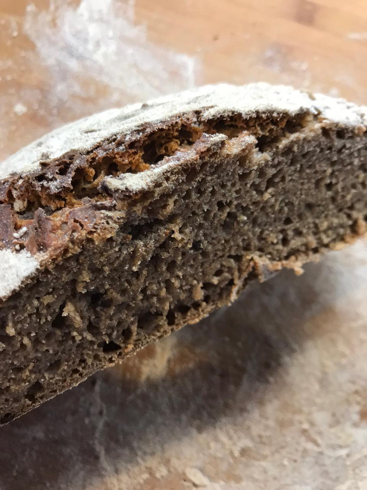

# Make your own sourdough

Sourdough is an excellent way to make your bread more fluffy.
At the same time the taste becomes a little sour adding excellent flavor
to the bread. A welcome side effect is that you can eat your bread for a
longer period of time as it does not catch mold as fast as yeast-only bread.
[This is because of the antibiotic ingredients.](http://news.bbc.co.uk/2/hi/science/nature/881477.stm)
Good news, it is really easy to make your own sourdough.

Personally I find sourdough amazing as it is an all natural product.
It has been there for thousands of years. The story goes that an Egyptian
woman has left a piece of dough near the Nile river. After a few days her
bread smelt funky. She decided to use that dough for her bake and thus
discovered sourdough. Mankind uses fermentation for many great products, wine,
beer, sauerkraut, cheese and sourdough. It requires a little time initially to
create your own sourdough, but afterwards you can re-use the sourdough for
every future bake. Do not worry, the initial time invest is very small. You
will be rewarded with amazing bread that only contains 3 ingredients: Flour,
Water and Salt.

Just to be fully transparent, this is about the time that it will take you to
complete your sourdough:
* The whole process will take you 7 days with around 2 minutes of time per day.
* That means you will spend only 14 minutes in total to have your own sourdough ready.
* I like to call this dough the mother dough, as it is the mother of all my doughs.

Nowadays bakeries add artificial yeast to the dough. The sourdough itself is a
little unstable in handling and requires more work. Overtime the bread becomes
sour, at some point too sour. The sourness attacks the integrity of the bread.
Thus it becomes important that you have proper timing. With yeast only bread
this does not happen. You can ferment for a longer period of time without
experiencing the negative side effects. This is way easier to do for a large
scale bakery.

The traditional breads before we had sourdough were more flat-breads. You can
compare them to Roti style breads in India. They are flat a little more
crunchy. But typically they do not have a large open crumb. If you attempted
to bake them like a bread you would end up with a large big brick.

Have you ever wondered why at some point your food suddenly starts
having mold all around?  It's because there is natural yeast and other bacteria
in the air. When setting up a sourdough we want to trap as much of this
natural yeast and bacteria inside of our dough.
The bacteria releases lactic acid when digesting the flour, and the
yeast is in charge of creating the carbon dioxide which makes the bread fluffy.
The dough gives the bacteria and yeast a really amazing place to live, and they live in harmony and balance.
As a baker, it is your job to ensure that they feel happy and enjoy their home.

The quantities of yeast and bacteria in the air is minimal and thus it
takes some time to gather large quantities in your dough.  That's why your
first sourdough can take up to a week until significant yeast/bacteria has
entered your dough and reproduced. The flour that you use for your initial
seed dough is also important. Full-grain flour is what you want, because
naturally yeast cells have gathered on the hull of the grain. Rye seems to
work best as it has more yeast naturally on the hull than other grains.

## Requirements

* 400 grams of full grain wheat flour (Look for flour with Whole in the word like Wholemeal or Wholegrain)
* You can also take rye, spelt or whatever full grain flour you have available.
  Don't worry too much, you can later on feed your mother dough with rye to make it more ryish.
  It's just about getting a nice and yummy place for the bacteria and yeast.

## Instructions

### Day 1

Take a big bowl and add exactly 100 grams of water and 100 grams of flour.
Make sure you stir everything nicely. You want a homogeneous mixture of dough and water.
The water you use daily should always be between 20° and 30° degrees Celsius,
as that is the ideal temperature for the yeast and the bacteria.
Generally the colder the water, the slower the process. But at some point even
for humans it becomes too hot and we collapse. There is a tipping point. Try
to stay in the suggested temperature range.

Place the bowl somewhere in your kitchen, don't cover it.
We want the maximum amount of air to get into contact with your dough, to
invite all the good bacteria and yeast to feast.
The temperature of the room where you store the dough does not matter too much.
It should not be freezing, and not super warm.
If it is colder it might take a little longer to get the mother dough ready.
If it is warmer, it could be done sooner.
Regardless, just stick to the 7 day strategy and you will be fine.

### Day 2

Add another 50 grams of flour and 50 grams of warm water. Stir everything.
Cover the dough with plastic wrap, not airtight. Just a little a bit. We have
gathered enough yeast and bacteria from the air on the first day. Now we want
our seed bacteria and yeast to reproduce.

### Day 3

Add another 50 grams of flour and 50 grams of water. Stir everything.

### Day 4

Add another 50 grams of flour and 50 grams of water. Stir everything.

### Day 5

Add another 50 grams of flour and 50 grams of water. Stir everything.

### Day 6

Add another 50 grams of flour and 50 grams of water. Stir everything.

### Day 7

Add another 50 grams of flour and 50 grams of water. Stir everything.

### Day 8

You are done 🎉. You are ready to bake your first bread with your own sourdough.
When not needing the mother dough, cover it with some foil and place it in your fridge.
This slows down the bacteria and yeasts' activity.
Unless you want to start baking now, place the sourdough in the fridge.

## Baking

A healthy formula is 20% sourdough for a rye bread/full grain bread.
Assuming you would bake 500 grams of flour, you will need 100 grams of sourdough.
This is also called `Sourdough starter`.

The typical process for baking is as following.

1. Calculate how much sourdough you are going to need
2. Remove the mother dough 1 day before the bake from the fridge
3. Create your sourdough starter by mixing 1:1:1. This means assuming you want
   to create 100 grams of sourdough starter, you will need: 33 grams of mother dough,
   33 grams of water and 33 grams of flour.

In reality though we are always creating a little more starter since that
starter will become the new mother-dough. That's right, we never need all
mother dough. We are in fact going to discard it from time to time. Or - if
you feel like, you can use all of the left over mother-dough to create some
pancakes, waffles or a really sour bread.

Correcting the above said - you will want to have approximately 50 grams more
sourdough starter than you actually need. So you would mix for a desired 100
grams of sourdough starter 50 grams of mother-dough, 50 grams of water and 50
grams of flour.

Creating the starter is typically done 12-24 hours before the bake. This allows
your yeast/bacteria to become active again. They have been freezing in the
fridge. In fact depending on your time schedule, I do 2 feedings before I bake
my bread the next day. That's because I will have less fermented flour in the
actual bread. Too much acid can mitigate the quality of the flour. I suggest
to try with 1 single feeding first and then advance the moment you feel
comfortable. You can also adapt the ratio 1:2:2 (1 part mother dough, 2 parts
water, 2 parts flour). Note how the ration water:flour is always the same. You
always want to feed your starter with the same amount of water and flour. It
makes it very easy to calculate.

Your sourdough starter is ready to use once it has doubled in size. In my case
that's around 12-24 hours after removing from the fridge. When I keep it at room
temperature in around 8 hours. Once it doubled in size proceed and bake your
bread. Place the leftover sourdough back in the fridge. It will become your
new mother dough.

You can maintain your mother dough for a very long time.
[There has recently been a report on a woman having a 122 year old sourdough starter.](http://trib.com/news/state-and-regional/newcastle-woman-maintains--year-old-sourdough-starter/article_000fcb17-5a5a-5590-84c2-3b55bb1d80fa.html)

All the recipes follow this simple principle:

1. Take some of your mother dough from the fridge. Discard the rest or store
   in another container to make pancakes/waffles/super sour bread.
2. Feed the taken dough with 1:1 flour/water.
3. Wait for 12-24 hours.
4. Mix the starter into your dough
5. Return the leftover starter back to the fridge in a new container
6. Start the bake.

Below is what many first ever baked sourdough bread looked like. If yours looks somewhat like this, you did a good job. It was a mixture of 50% rye and 50% full grain.

This is what it looked like from the inside:

If you don't feed your mother dough it will eventually starve as it has no more food.
Don't worry, my mother dough survived for 4 weeks in the fridge.
You are not forced to bake every weekend.  Some liquid may gather on top of your
mother dough, that's usually lactic acid and a good amount of alcohol.
Just remove that, feed your dough again and you should be good.
