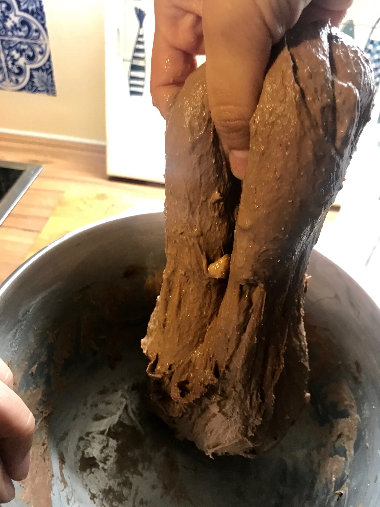
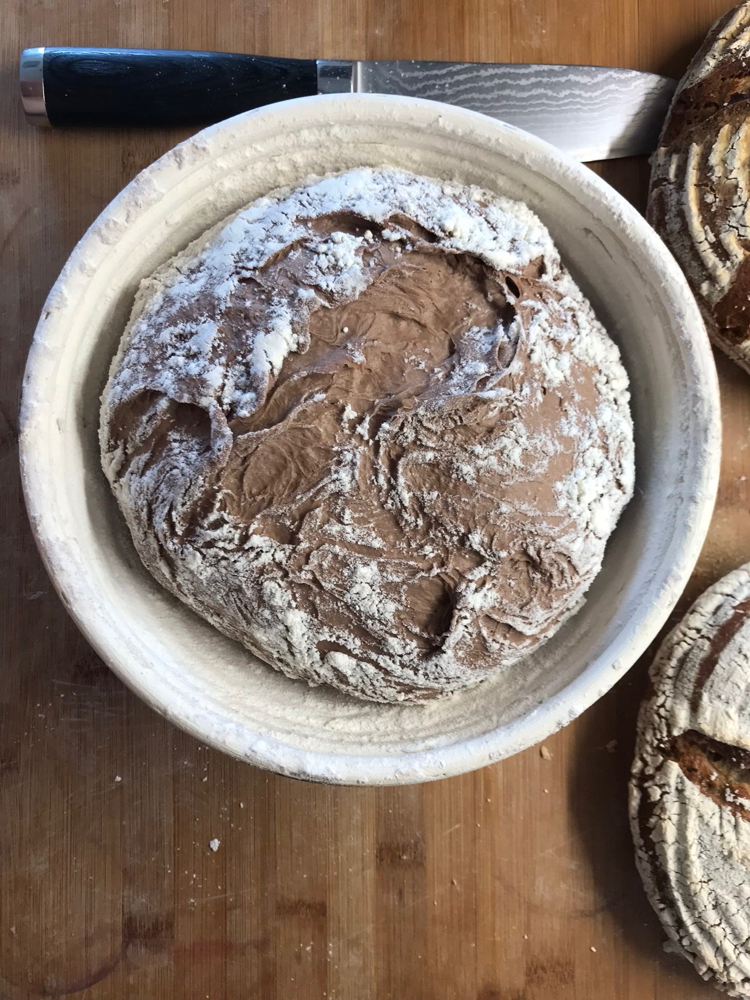
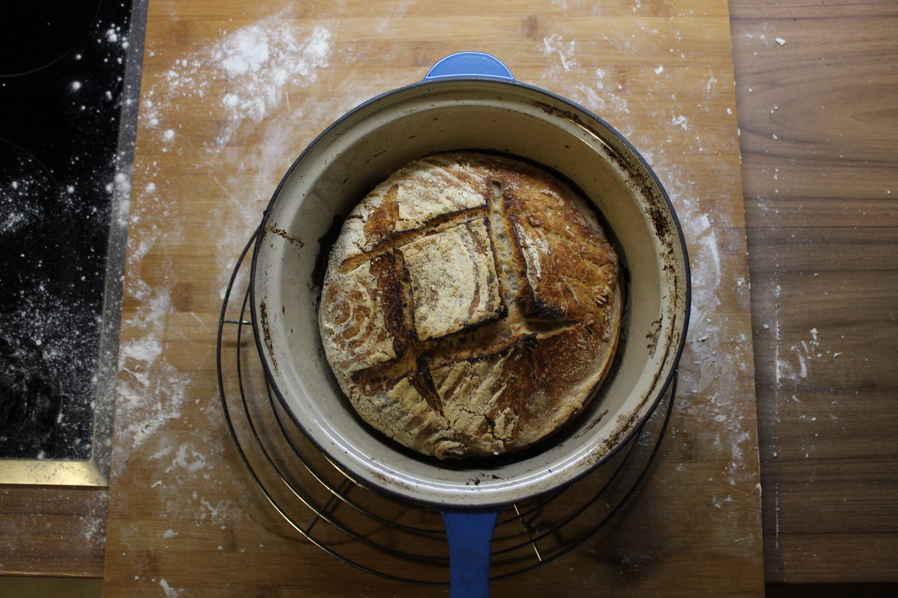
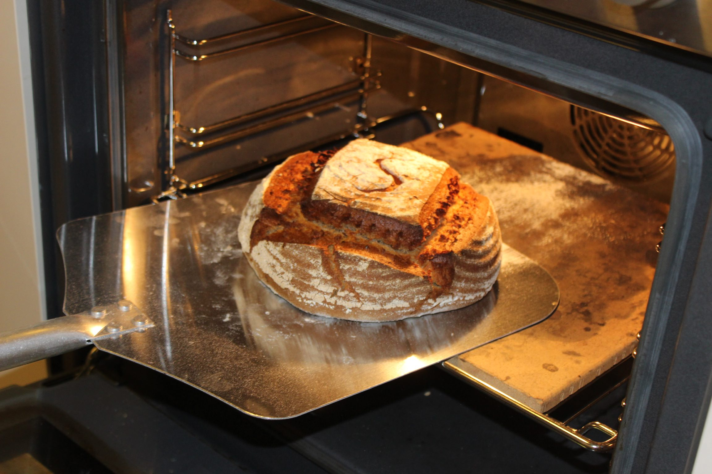

# Tools

The goal of this small guide is to clarify what kind of tools you need for baking your bread.

I want to start by saying that 10,000 years ago there were no tools available for baking bread.
Be very careful when people tell you to buy specific tools.
However with 10,000 years of technological advances there are a few gadgets that make it easier for you to bake bread.
If you have no tools, don't worry, you can get started anyways.

## Bowl (required)

You should have a nice bowl in which you can prepare your bread. This can be made out of glass, metal or plastic.
The bigger the better, as it will be easier for you to work the dough in a larger bowl.
It's advisable to have two bowls. You'll need one to prepare and mix the dough.
For shaping the dough and letting it rest before baking in the oven a second, clean bowl with some parchment paper is ideal.
If you have a banneton you don't need the second bowl.

## Oven (required)

Instead of an oven you can also use a barbecue or a fire. However, an oven is practical and easy to control.
The maximum temperature you need is around 230 degrees Celsius (450 F), so having an oven that goes up to 250 C (482 F) is ideal.

## Baking tray (required)

Some kind of oven-proof plate on which you can put the dough or any other container in your oven.
In case you have no pizza stone or dutch oven, it's advisable to cover this with parchment paper so your dough will not stick to it.

## Banneton (optional)

A banneton is used to let your dough rise one last time before baking it.
Instead of using one bowl with parchment paper I prefer the banneton, as I don't need to buy parchment paper.
Also to me it feels more natural to just let the dough rise in a wooden banneton.
Additionally a banneton powered bread I believe looks visually a little more appealing.
You have nice circles of flour on the top of your bread.

## Metal / glass tray (optional)

Some kind of container able to endure high heats is ideal.
If you have a dutch oven you will not need this.
The tray will be used to create additional steam inside of your oven.
Before baking you put water inside of this tray and let it cook.
The steam supports the bread while rising as the crust does not get crispy that fast.

## Dutch oven (optional)

Although the dutch oven is optional I highly recommend it.
You can also re-create your own dutch oven using a pizza stone and a large lid. Basically all you need is some kind of device that fully covers your bread in the oven.
The reason is that the water that exits your dough will stay trapped in the dutch oven, to be some kind of dough sauna. The dough remains wet and can rise more in the oven.
The crust does not get crispy instantly, supporting the rise of the dough. The result is a fluffier bread with more air bubbles.
Furthermore the dutch oven is a good source of even heat, making sure that the bread cooks evenly from all sides.

When using the dutch oven you also no longer need parchment paper at all. The bread dough is inserted into the dutch oven without the parchment paper.

## Pizza stone (optional)

A pizza stone is nice, as it can store a lot of heat.
The moment your bread dough gets into contact with the stone a lot of heat energy is released directly to the dough.
This creates a yummy beautiful crust.

