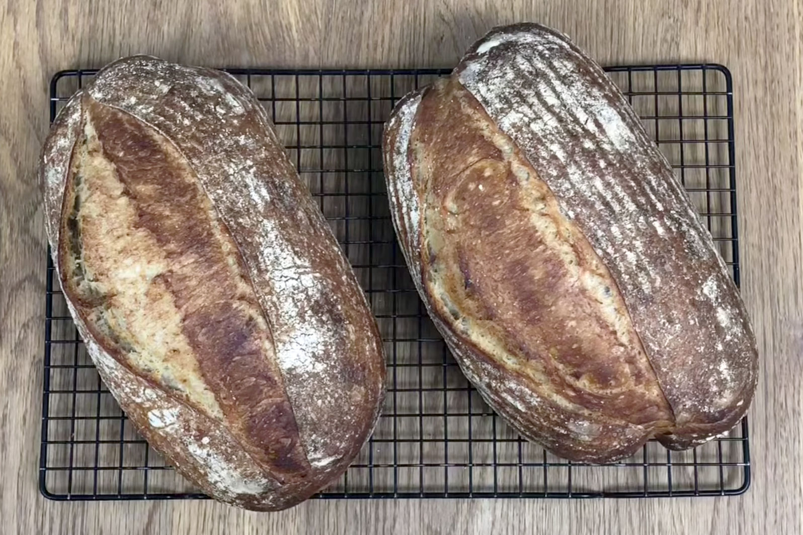

# Tools

The goal of this small guide is to clarify what kind of tools you need for baking your bread.

I want to start by saying that 10,000 years ago there were no tools available for baking bread.
Be very careful when people tell you to buy specific tools.
However with 10,000 years of technological advances there are a few gadgets that make it easier for you to bake bread.
If you have no tools, don't worry, you can get started anyways.

#### Required
* [Love](#love)
* [Oven](#oven)
* [Bowl](#bowl)
* [Baking tray](#baking-tray)

#### Desired
* [Dish cloth](#dish-cloth)
* [Baking Sheets/Paper](#baking-sheetspaper)
* [Colander/Strainer](#colanderstrainer)
* [Cutter Slashing Tool](#cutter-slashing-tool)
* [Kitchen Scale](#kitchen-scale)
* [Dough Scraper](#dough-scraper)

#### Optional
* [Banneton Proofing Basket](#banneton-proofing-basket)
* [Pizza stone](#pizza-stone)
* [Dutch oven](#dutch-oven)
* [Shower Cap](#shower-cap)
* [Plain Plastic Scraper](#plain-plastic-scraper)
* [Stand Mixer](#stand-mixer)
* [Cooling Rack](#cooling-rack)

## Required

### Love
Doing bread is a nobel activity, you need to put love in it. You take care of it and the result will change you perception of what bread is. This doesn't mean that you cannot do anything else at the same time. The bread preparation has to fit you life and not vice versa. Love is for sure something that you want to put in your bread.

### Bowl
You should have a nice bowl in which you can prepare your bread. This can be made out of glass, metal or plastic.
The bigger the better, as it will be easier for you to work the dough in a larger bowl.
It's advisable to have two bowls. You'll need one to prepare and mix the dough.
For shaping the dough and letting it rest before baking in the oven a second, clean bowl with some parchment paper is ideal.
If you have a banneton you don't need the second bowl.

### Oven
It is ideal have an oven able to reach 250°C / 482°F. The first 15mins to half an hour you will use the oven at that temperature if you use a dutch oven.
Instead of an eletric oven you can also use a barbecue/kettle or a wood oven (pizza oven). The latter one will increase the flavour and the thickness of the crust. However, a normal kitchen oven is more practical and easy to control.

### Baking tray
Most of the ovens come with a backing tray. It is a oven-proof tray/plate on which you can put the dough to bake it once it is ready.
The baking tray can be use in case you have neither pizza stone nor dutch oven, it's advisable to cover it with baking paper so your dough will not stick to it.

## Desired

### Dish cloth
You need at least one dish cloth either for cover the dough during the fermentation or to use in the proofing basket.

### Baking Sheets/Paper
You definitely want to have baking paper to avoid the dough to stick on the surface you will bake on. Instead of baking paper, you can buy a silicone baking mat which can be reuse oven and over, but it cannot be used inside a dutch oven.

### Colander/Strainer
In case you don't have a [Banneton Proofing Basket](#banneton-proofing-basket), you can use a strainer with a [Dish cloth](#dish-cloth) in it to make the dough does the last raising before to bake it.

### Cutter Slashing Tool
After many cuts in the dough I guarantee that this tool is woth the cost of it. You cut the formed dough before bake it allow the bread to grow properly during the baking. Alternativelly you can buy spare razor blades only.

### Kitchen Scale
A kitchen scale is very useful even if it's no necessary, and if you are thinking to buy it, buy one very precise. Bread is an activity very close to chemistry, and most of the time you want to follow the quantities you find in the recepies.

### Dough Scraper
You can use dough scraper to release the dough from the table every once in awhile completely cutting out the need to add extra flour. It is also used to cut and divide the dough in pieces.

## Optional

### Banneton Proofing Basket
A banneton is used to let your dough rise one last time before baking it.
Instead of using either a [bowl](#bowl) or a [strainer](#colanderstrainer) with a [dish cloth](#dish-cloth), I prefer the banneton which will help mantaining a proper shape of the bread.
On top of it, it feels more natural to just let the dough rise in a wooden banneton.
Additionally a banneton powered bread I believe looks visually a little more appealing, you will get nice circles of flour on the top of your bread.

### Pizza stone
A pizza stone is a nice to have, it distributes heat evenly. The moment your bread dough gets into contact with the stone a lot of heat energy is released directly to the dough and it boosts the rising in the fist phase of the baking.
You may want to use either a tray or a pot with water in it to create additional steam inside of your oven. The steam supports the bread while rising as the crust does not get crispy that fast.

### Dutch oven
Although the dutch oven is optional I highly recommend it.
You can also re-create your own dutch oven using a pizza stone and a bread cloche.
The reason is that the water that exits your dough will stay trapped in the dutch oven, to be some kind of dough sauna. The dough remains wet and can rise more in the oven.
The crust does not get crispy instantly, supporting the rise of the dough. The result is a fluffier bread with more air bubbles.
Furthermore the dutch oven is a good source of even heat, making sure that the bread cooks evenly from all sides.

When using the dutch oven you can avoid the use of the baking paper if you are agile and quick to put the dough in the dutch oven. Otherwise you can help yourself with baking paper to lift and move the dough inside the dough inside the dutch oven and reduce the chances of a burn.

### Shower Cap
I offen use a disposable shower cap (the ones you take in the hotels) to cover either the [bowl](#bowl) or the [banneton](#banneton-proofing-basket) and avoid the dough to get dry.

### Plain Plastic Scraper
They are similar to the [dough scraper](#dough-scraper) but they are made out of plastic. They are primarily used to remove the dough from the bowl where the dough is resting. I can say you can potentially use also to cut the dough a part and scrape the dough from the table.
Sometimes this tool is also used to mix/knead the water and the flour initially.

### Stand Mixer
We can talk about Stand Mixer for a life time. Let's keep it simple though. A Stand Mixer helps you to knead the dough, it makes very easy to structure glutinic mesh in the dough. The Stand Mixer also reduces the time and the effort you spend to get to a smooth dough.
Once you decide to buy the stand mixer, you don't want to go cheap. You want to buy a good one which will last longer (I am talking about decades) or maybe for good!

### Cooling Rack
Once the bread is baked and you take it off from the oven you want to make the bread cool down properly before start slicing it. The cooling rack is the right place to do it.

