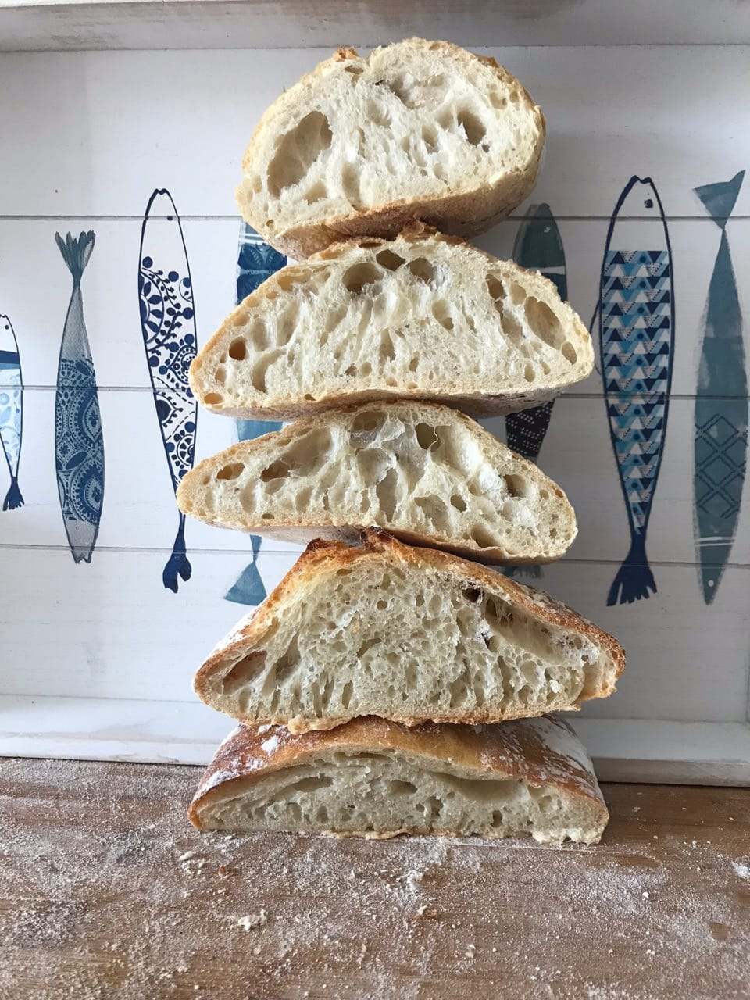

# Different hydration levels on yeast bread

I wanted to test different hydration levels of the bread to see impact on the
crumb, exterior and taste of the breads. In this case dry yeast was used
instead of sourdough.

100% hydration vs. 90% hydration vs. 80% hydration vs. 70% hydration vs. 60%
hydration.

I baked all the breads with 0.25% dry yeast and 2% salt. The flour I used was
150 grams of all purpose flour. I gave each of the doughs 2 stretch and folds over 3 hours.
Then I shaped and let them bulk ferment in the fridge over night. All of them
I baked in the morning in a steamed oven. After half the baking time I removed
the steam.

# Pictures

# Result

From top to bottom, 100% hydration, 90% hydration, 80% hydration, 70%
hydration and then 60% hydration.

Taste wise and consistency wise 70% hydration was the winner followed by 80%
on place 2. It would be interesting to explore whether similar results can be
observed with sourdough breads.
