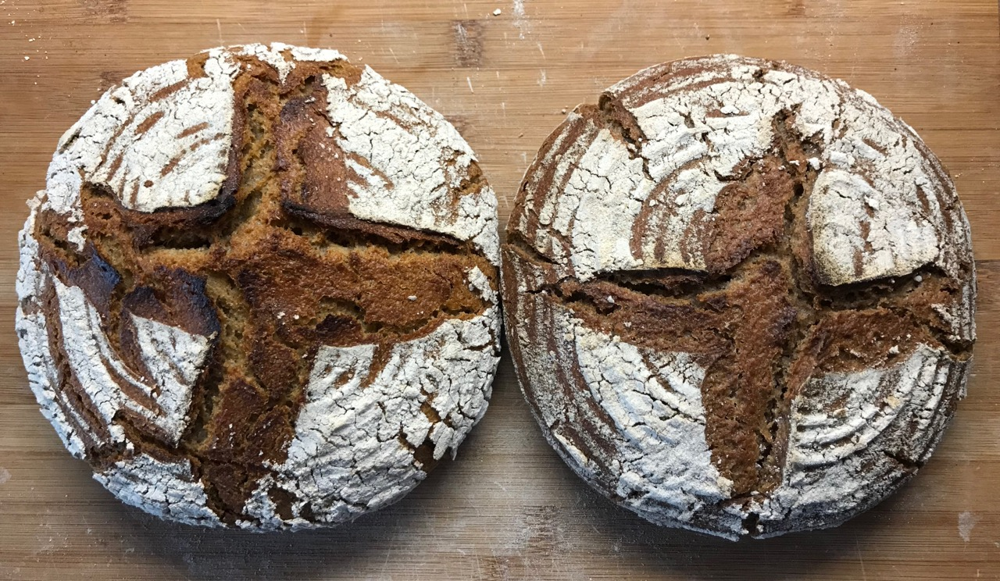
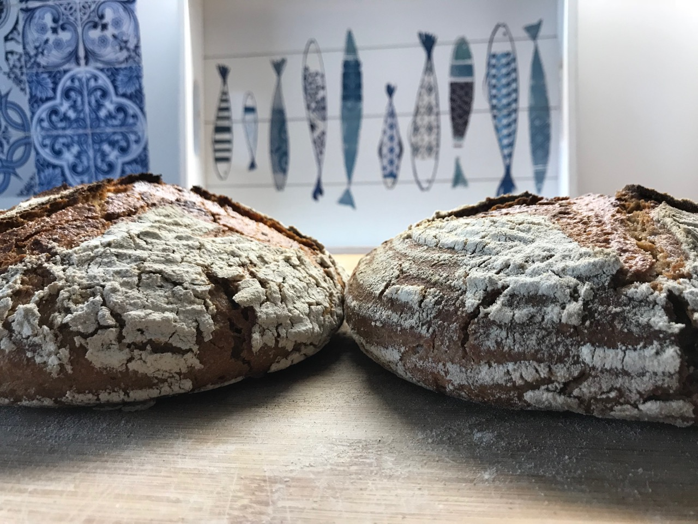
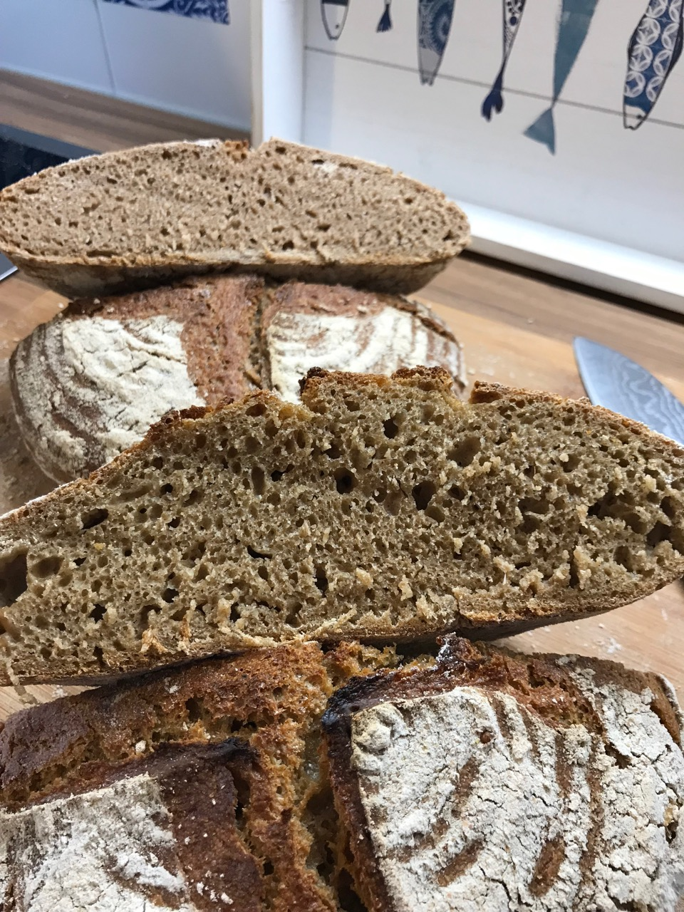
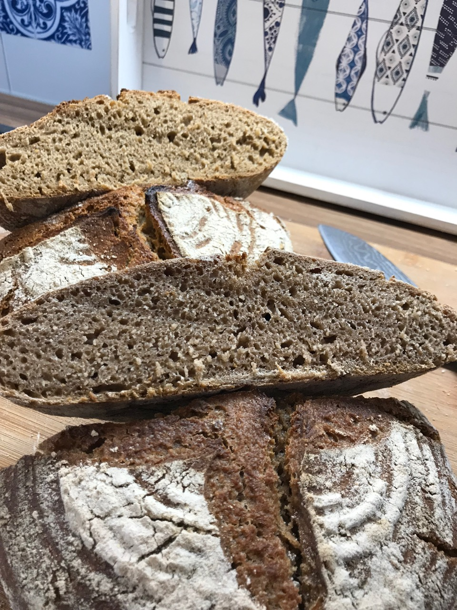

# Einkorn vs. Emmer

Test how two different ancient grains perform in a direct comparison.

Both of the recipes are exactly the same with only the flour being changed.

[The whole bake has been recorded here.](https://www.youtube.com/watch?v=PehhnV1lW2o)

# Bread 1

I followed the [Einkorn bread recipe.](../recipes/sourdough/einkorn-sourdough-bread.md)

# Bread 2

I followed the [Emmer bread recipe.](../recipes/sourdough/emmer-sourdough-bread.md)

# Pictures

# Result

Both of the breads were quite similar when baking. The doughs felt very
sticky, almost like a rye dough. The emmer crumb looks a lot like a rye crumb.
The Einkorn crumb has a distinct yellowish color.

Taste wise both of them had a distinct rich taste. They were in the middle of
wheat and rye. Rye has a stronger taste. It felt like a really smooth
experience.

There is no winner here, both of them are equally great.
