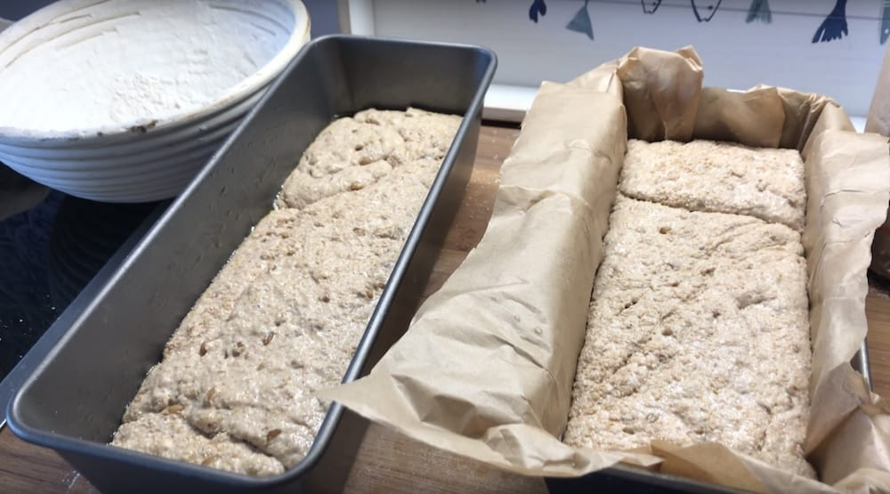
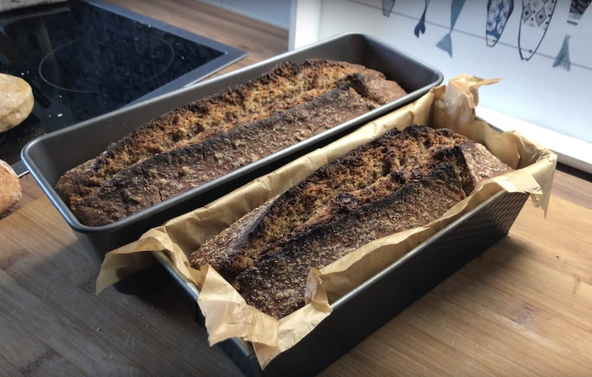
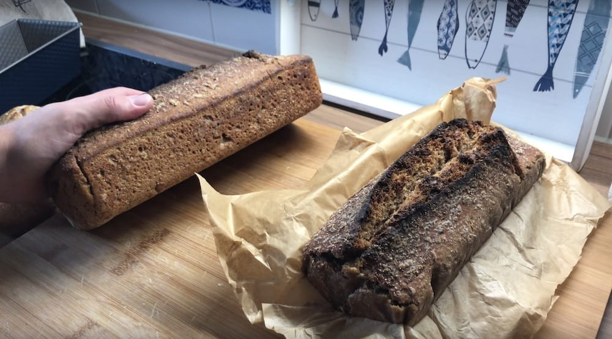

# Oiled loaf pan vs. parchment papered loaf pan

The goal is to find the best way to bake bread in a loaf pan, without the pan
sticking to the loaf.

After researching 2 strategies were identified. One of them was to use
parchment paper, the other one to add oil to the loaf pan.

In other cases when using an iron dutch oven I pre-heated the dutch oven.
Then I placed the shaped and proofed dough directly in the pre-heated dutch
oven for baking. The high temperature caused the surface of the dough to seal,
making it non-stick. However with a loaf pan this does not work, as the bread
is proofing inside of the loaf pan. In previous attempts the dough just kept
sticking to the loaf pans. Loaf pans are a nice alternative to using a
banneton. They give the bread a consistent shape, allowing you to cut slices of
similar size.

The breads I baked in this experiment were Emmer sourdoughs. The dough itself
was even a little more sticky than a simple all-purpose dough.

# Bread 1

Placed in a loaf pan covered with olive oil.

# Bread 2

Placed in a loaf pan covered with parchment paper.

# Pictures

[I also recorded the whole experiment in a video.](https://www.youtube.com/watch?v=4j5PGepJSKM)

# Result

I prefer the version with the olive oil. The bread stuck less to the loaf pan.
Furthermore I don't need to waste parchment paper. I used little oil so the
impact on the taste was minor.
