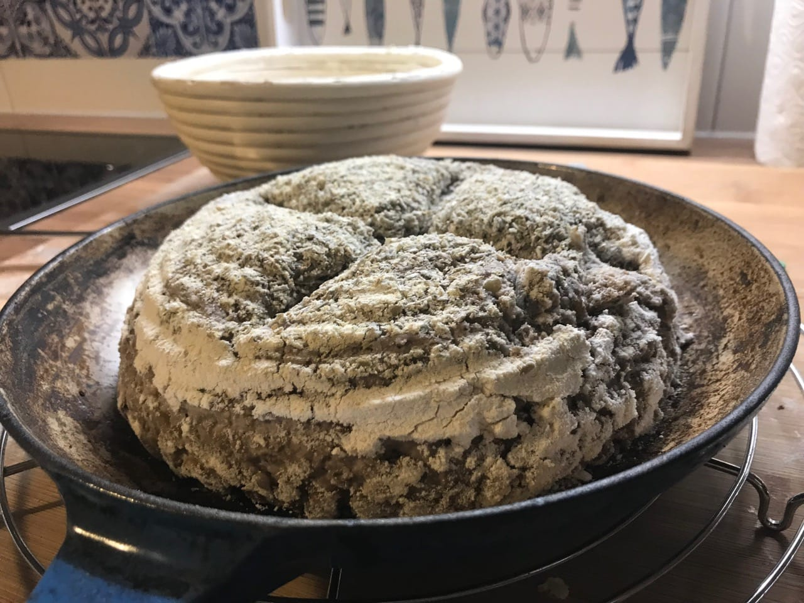
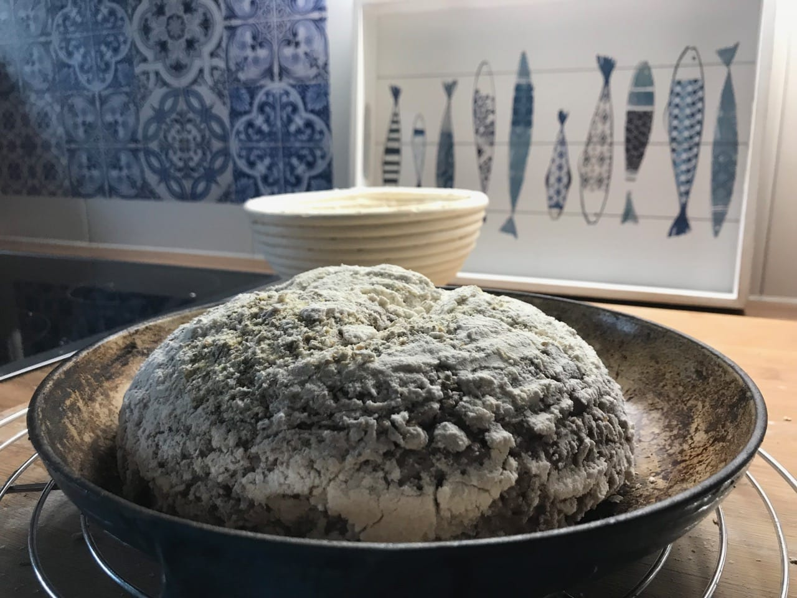
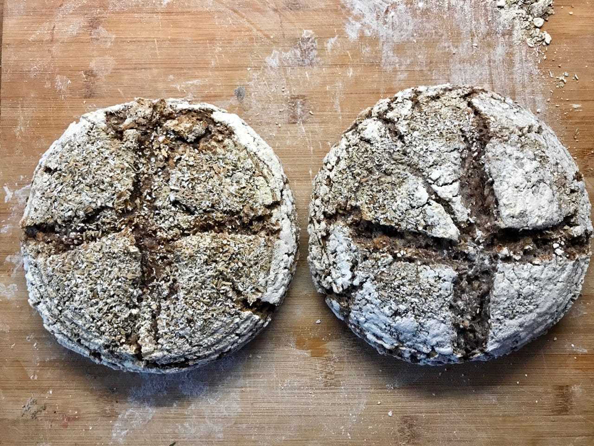
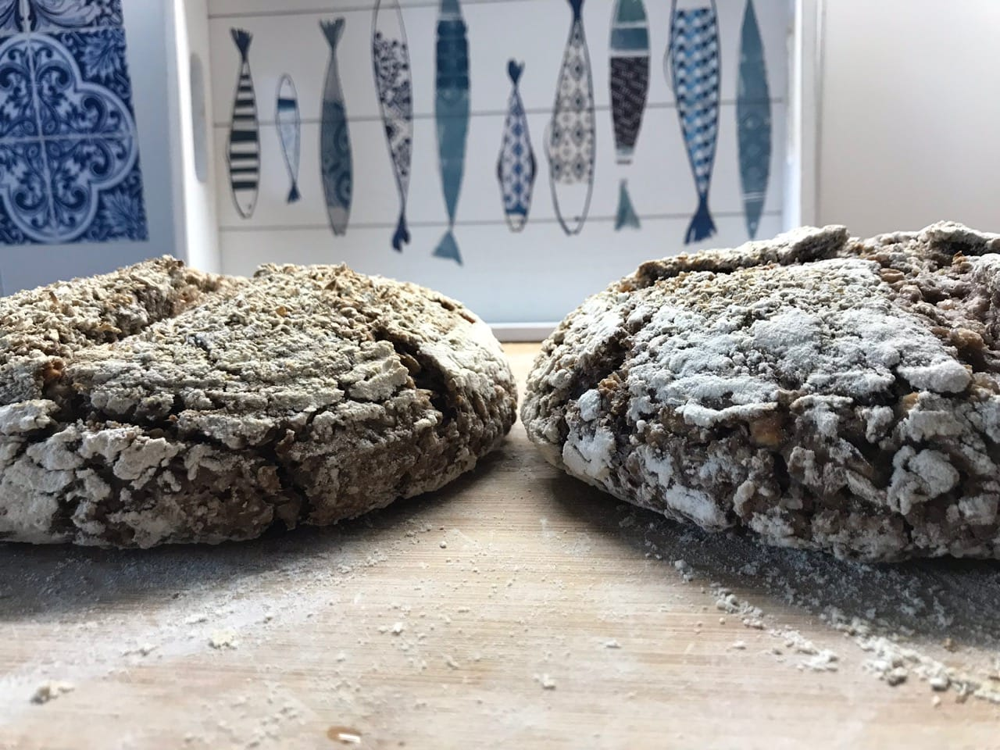
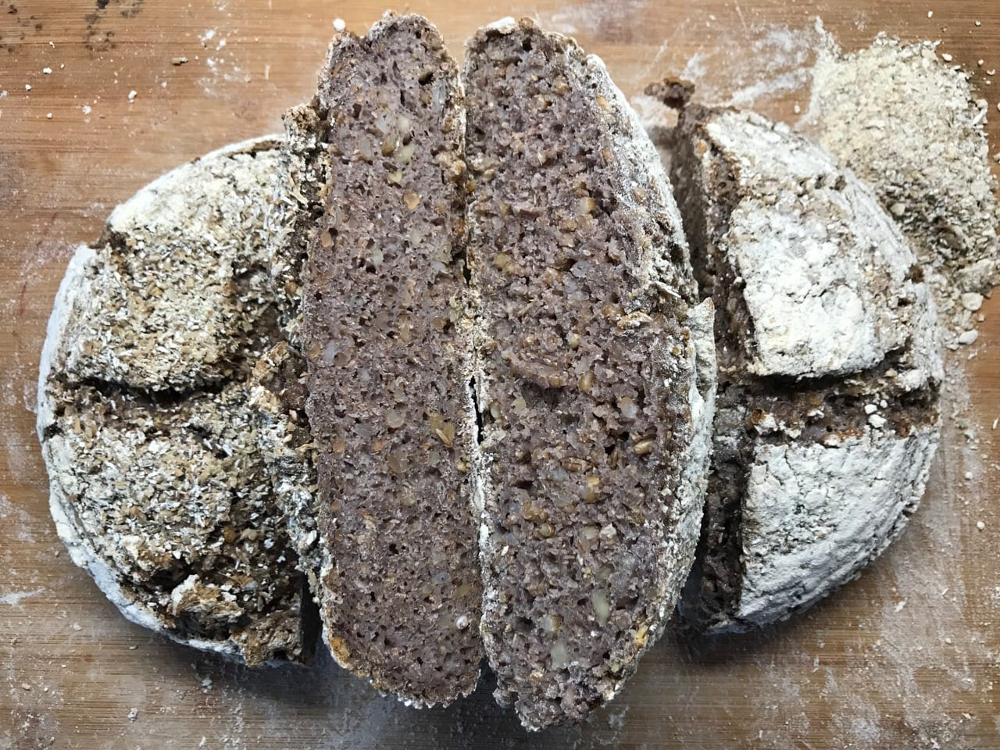

# Proofing Sourdough at room temperature vs. fridge

Test what impact proofing a sourdough bread has at room temperature vs. in the
fridge. I long had the feeling that if I bake cold sourdough bread it has more
oven raise than a room temperature proofed one. The process of
letting a dough rest in the fridge is also known as retarding. Because of the
low temperature in the fridge the yeasts' and bacteria's' activity is reduced,
slowing the whole fermentation process.

# Bread 1

I baked a sourdough bread following the [standard sourdough recipe.](../recipes/sourdough/standard-sourdough-bread.md)

Adjustments to the recipe:

* I used 200 grams of flour
* 300 grams mixed wheat grains = 150%
* 50% of walnuts
* I used oats/flour on the surface during shaping to have a more rustic taste

After shaping I let the bread rest for 3 hours in the banneton.

# Bread 1

Same ingredients as bread 1.

After shaping I placed the dough in the fridge over night for approx. 10
hours.

# Pictures

The room temperature dough stuck a little bit to the banneton. I had already
heavily covered the banneton on one side.

On the following pictures the room temperature dough is on the left. The
retarded dough is on the right hand side.

# Result

The retarded bread had more raise in the oven than the one raised at room
temperature. The crumb of the retarded bread looks more open than on the one
raised at room temperature.

Taste wise I could not notice a huge difference. Both of them tasted equally well.
The one I retarded over night was a little more wet when eating it. Reason
being that I baked it in the morning. The room temperature one I baked the
evening before.

Just from the visual perspective the bread retarded over night wins.

It would be interesting to conduct more research on whether a cold dough
sticks less to the banneton than a warm one.
