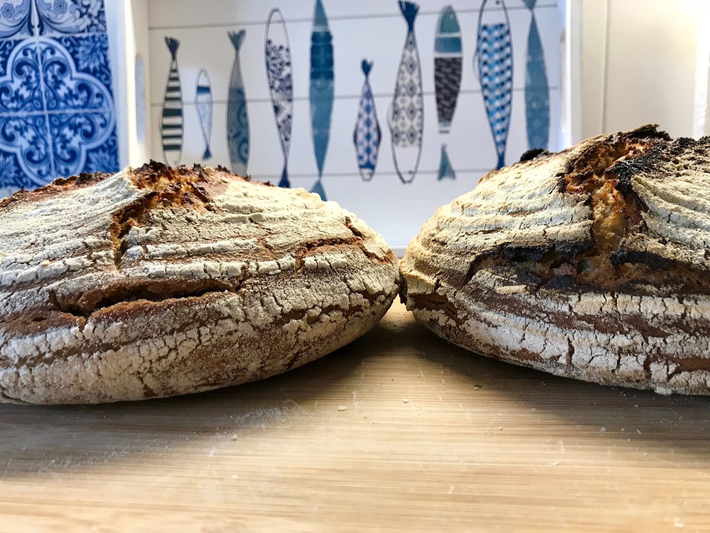

# Scoring at an angle vs. vertically

Test how the raise in the oven of the bread changes if you score it at an
angle versus vertically. The problem was that some of my breads turned out
flat like a pancake. I research on what I should adapt to make them look
visually nicer.

Scored at an angle with X vs scored vertically with a X.

# Bread 1

I baked a sourdough bread following the [standard sourdough recipe.](../recipes/sourdough/standard-sourdough-bread.md)

When scoring the bread I cut the bread vertically with a large X.

# Bread 2

Same ingredeients as bread 1.

When scoring the bread I cut the bread at an angle with a large X. It was
around a 45° degrees angle.

# Pictures

# Result

The vertical scored bread did have less oven rise. Taste wise they were the
same. The crumb was the same on both breads. The difference being that the
angled bread was a little higher. The bread that was cut vertically looked a
little bit like a flat pancake.

The winner is the bread scored at an angle.
