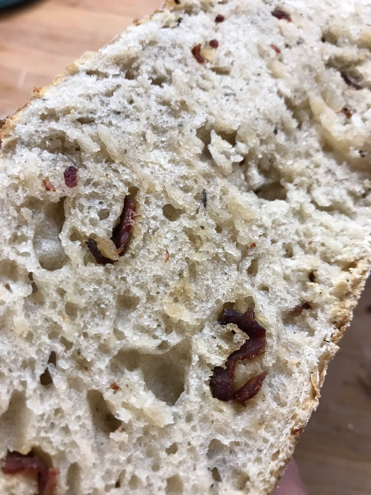
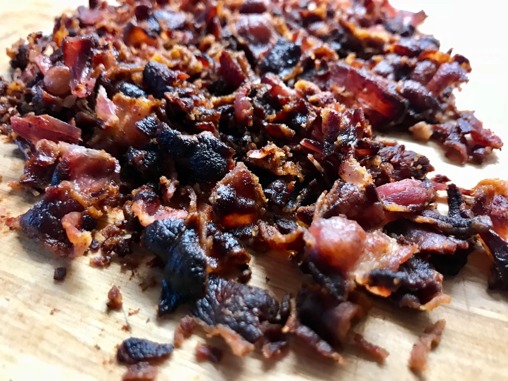
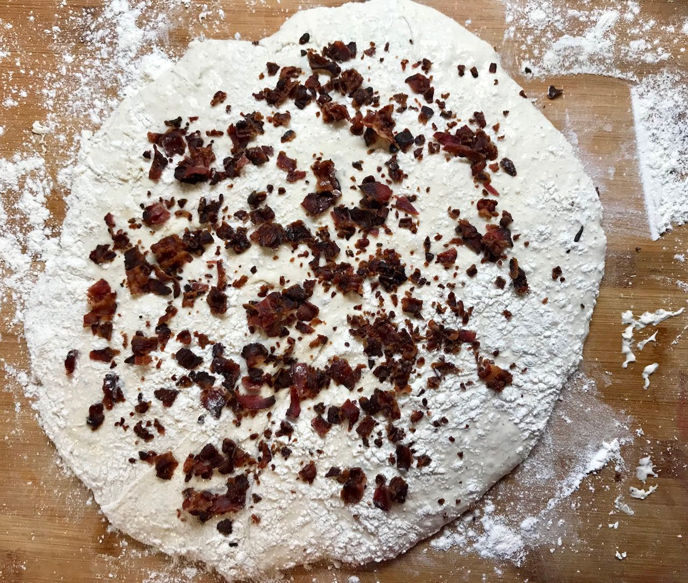

# Bacon Bread

If you love bacon then you will love this bread.
You will taste the lovely flavor of the wheat bread, and shortly after, a baconish taste follows creating an amazing combination of flavors.
This bread is excellent when inviting friends over for a barbecue.

## Custom Ingredients

- 100 grams of bacon. Add Recipe Customization phase.

### Pre steps

Fry the bacon in a pan and let it cool down on a paper towel to absorb excess fat. Place the bacon in the freezer.

### Recipe customization

Take the bacon from the freezer. Place the bacon evenly on the dough in front of you. Press the bacon lightly into the dough.

