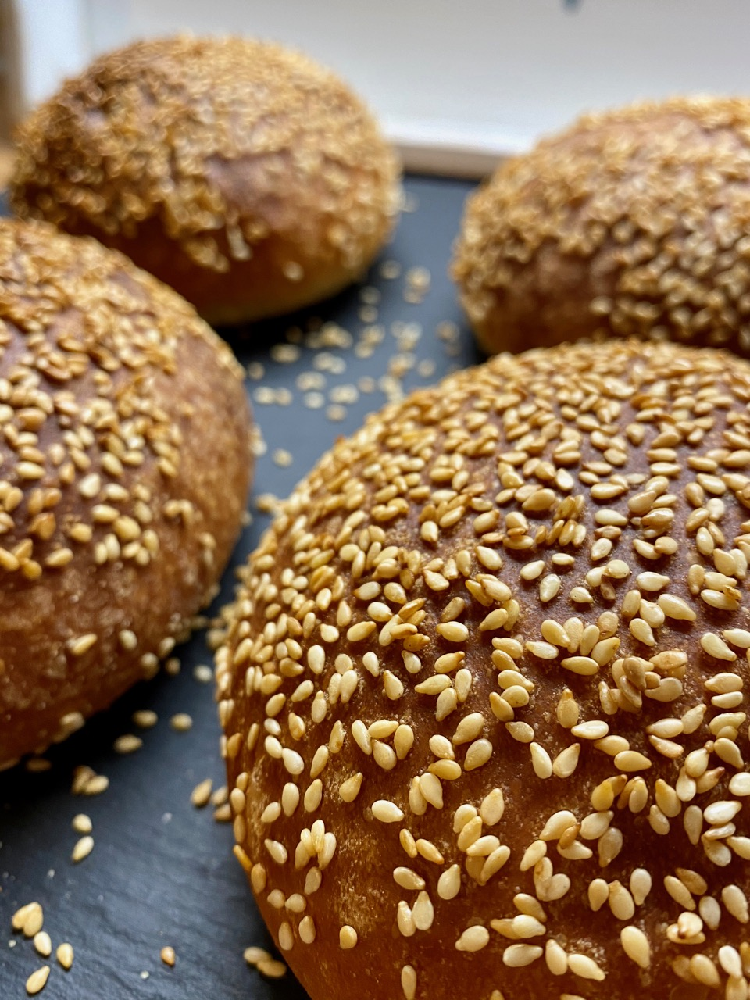
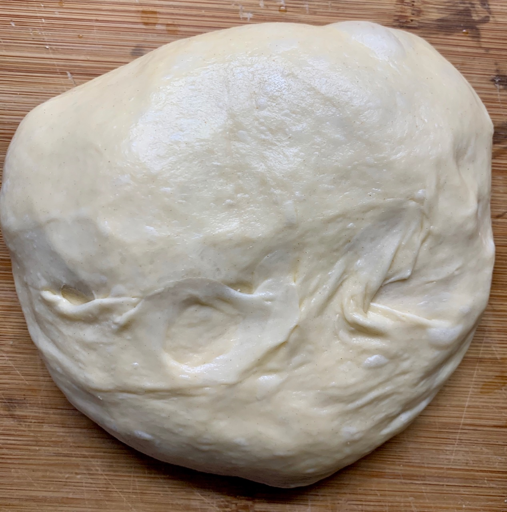
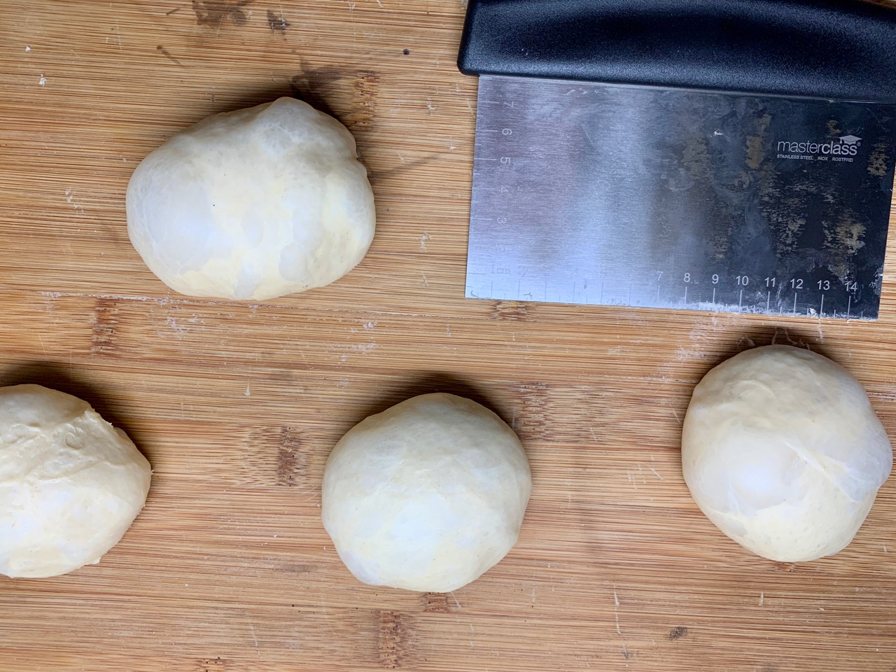
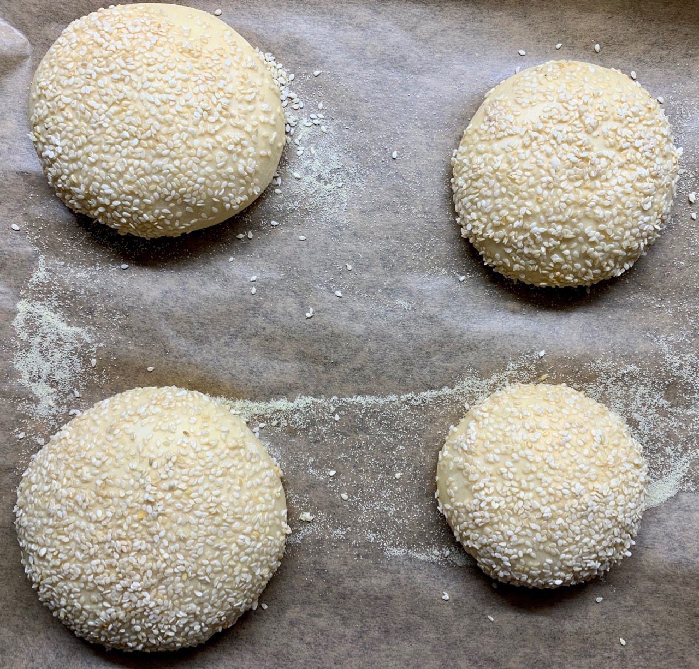
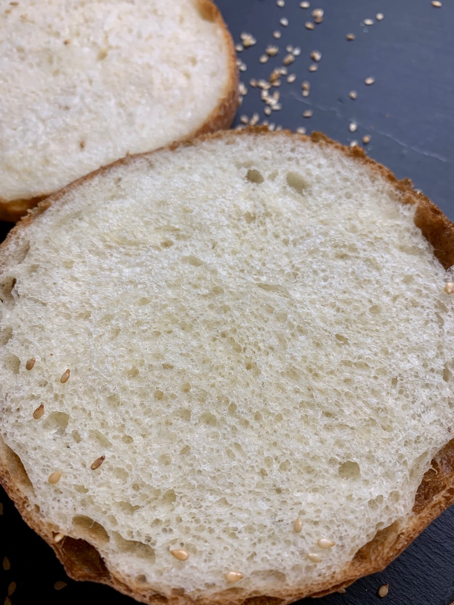

# Burger buns

This recipe will make you around 8 burger buns. The inside is super fluffy as we are adding a little bit of sugar and butter. They are sprinkled with some Sesame for an extra-burger like look.

## Ingredients

* 400 grams of flour
* 45% hydration, use warm water
* 10% butter
* 10% sugar
* 2% salt
* 1% dry yeast or 3% fresh yeast
* 1 large egg per 400 grams of flour

**For the topping:**

* 50 grams of butter
* **OR**: Egg wash. Mix 1 egg with equal weight of water. If the egg is 100 gram, mix it with 100 gram of water.
* Sesame seeds, around 50 grams.

**Other requirements**

* Baking tray
* Parchment paper
* Semolina flour

## Instructions

1. Liquify the butter in a pot
2. Mix it all together
3. Knead until the dough looks soft and silky
4. Take a break after 5 minutes and wait 15 minutes up to 30 minutes. This will help autolysing the dough. You will have to knead less
5. Do a stretch and fold every 30 minutes until your dough has doubled in size. Once it doubled we can proceed. Timings are really hard to give, because this This means you are ready for the next steps

1. Now we are going to start with shaping our buns. We need to split the dough into smaller pieces. You can take a scale, but I like to just cut the dough evenly with either a knife, or a dough scraper. I did not have too much time to do proper stretch and folds, regardless they turned out great. You can see that my dough overall looks rather unsymmetrical after bulk fermentation. Ideally you already have a smooth ball
2. Take out the dough from your bulk fermentation container and place it on a non floured surface
3. Take a knife our dough scraper and divide the dough into equal size pieces
4. Tuck each of the dough balls over the surface. You need tension at the bottom, that's why we did not flour the surface. This process is called pre-shaping. It takes a while to master it. See this video on how to do this: https://youtu.be/vEG1BjWroT0?t=279. If you are a bread baker you probably have done this before. It is a useful thing to learn, you need to do this for baking pizza as well. We are doing this because we want an already round dough to start our final shaping.

1. We created tension on the dough and now have to wait approx. 15 minutes with the dough balls on the surface. The gluten network is very tight and won't allow us to shape the dough properly. Grab a coffee and let the dough sit on the counter. It is the same with pizza, sometimes depending on the dough you have to wait an hour or so. Without it you can not spread the dough on the surface, it just will go back to it's initial form. We want the dough to be elastic, because this way we can create a larger surface where we tuck the dough on each other. The dough will stick to each other better. So this means the dough will hold together better, resulting in better oven spring.
2. Using your dough scraper or any other device that looks similar to one, scratch of the dough pieces and place them now on a floured surface
3. Shape your buns into round balls, just like you would shape a round bread. See this YouTube video (https://youtu.be/ww78_SfGyQE?t=195). You do not have to be too gentle here. We want the dough to deflate slightly because we want an even crumb later on in the final buns. For a bread this would not be an option, since typically you want a more open crumb
4. Heat up some more butter and brush the buns with with butter. Dive the buns in a bowl full of sesame seeds. They should be covered on the top with sesame seeds. As the dough will increase in size later, they will spread out all over the surface
5. Place them on a semolina floured parchment paper
6. Cover them with a kitchen towel or a baker linen if you have one
7. Let them proof until they doubled in size again

## Baking

Pre-heat your oven to around 230°C for at least 10 minutes.

You need as much hydration as possible because you do not want the dough to form a crust. The end result should be a super fluffy hamburger bun.

For that spray your buns with a lot of water. The water keeps the surface moist and prevents the maillard reaction from happening too early. That way no crust is formed.

Place your tray in the oven and spray the inside of the oven with some additional water. Every 2 minutes for the first 10 minutes oven the oven and spray the buns with water again. I did not have time to do this, that's why you can see larger pockets of air at the edge of the buns. The crust formed too quickly there. Regardless, they turned out great.

Your buns should be done after around 20 minutes, however this depends on your oven setup. Ideally wait until they are golden brown. Let them cool down for at least 60 minutes before cutting them oven. Enjoy.

