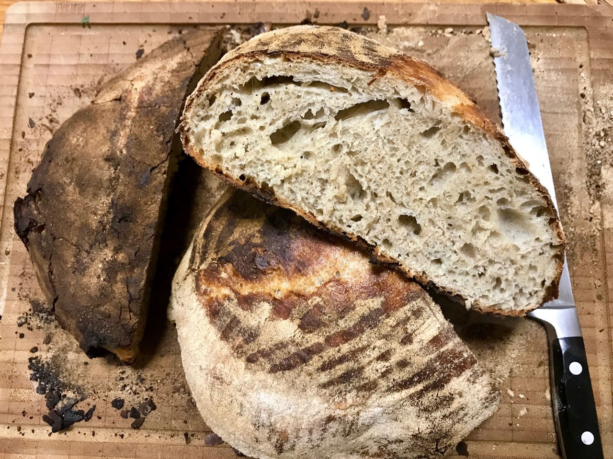

# French bread

The french bread is a simple white bread with an interesting twist.
The original French name for this kind of bread is *batard*.

French bakers like to add around 10% rye to their breads, to add a little bit of extra flavor.
On the first bite you taste the rye and then afterwards the regular flour.
At the same time the color of the bread is slightly browner making it look more rustic.
With only 10% rye the whole baking process does not change, the same techniques can be employed.
However, higher rye percentages can only be properly baked with sourdough.

Overall I make most of the breads with the 10% rye "hack", it's a great combination.

The above bread has been baked in a different oven. Same temperature and
minutes of baking as in the standard oven used at home. However the oven
was significantly hotter than the default one.
Thus the crust turned a little dark. This shows how different ovens are.
You have to test which temperature works best in your oven. Just blindly
following temperature suggestions might not result in your perfect bread.

## Custom Ingredients

- 450 grams of all purpose flour instead of 500
- 50 grams of rye (10%)
