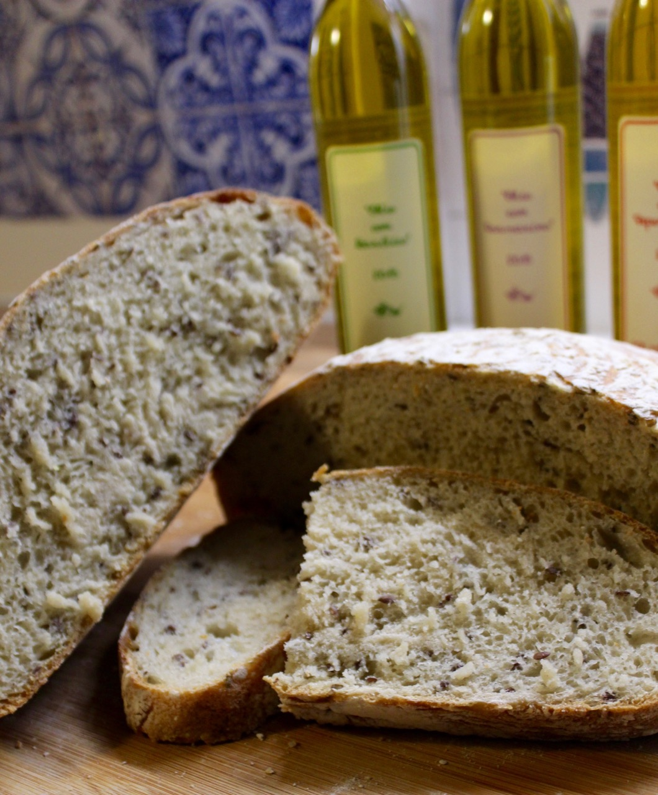

# Linseed bread

The linseeds add additional nutrients to your bread. Althoguh they
do not influence the final taste you might consider it a nice healthy
addition. This recipe is a good way to customize the default bakes you are
doing.

## Custom Ingredients

- 100 grams of Linseeds. Mix them in the dough directly.
