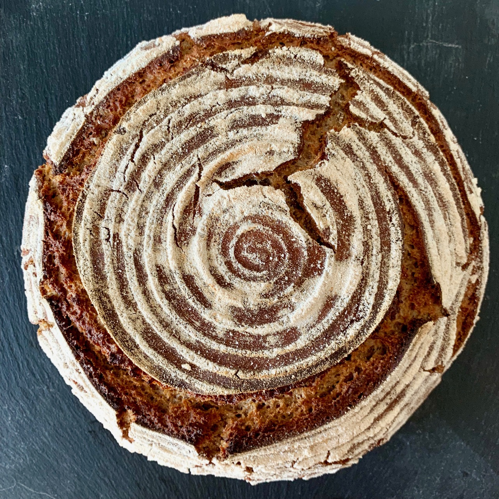
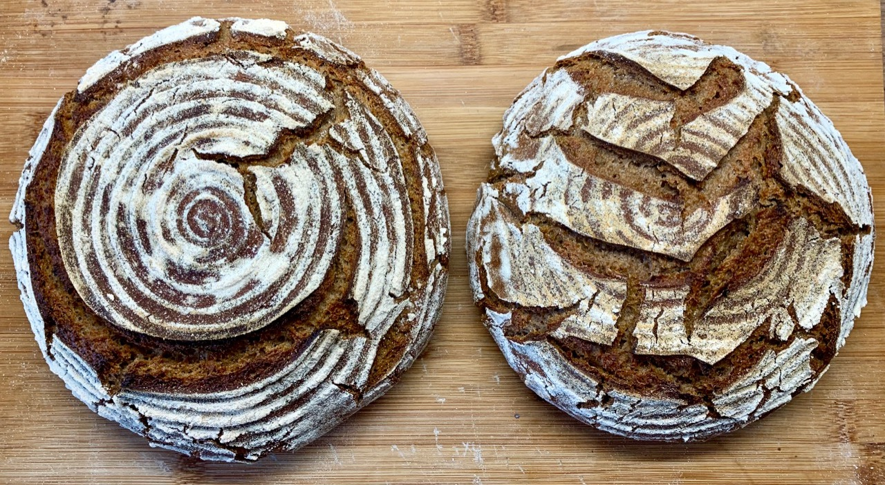
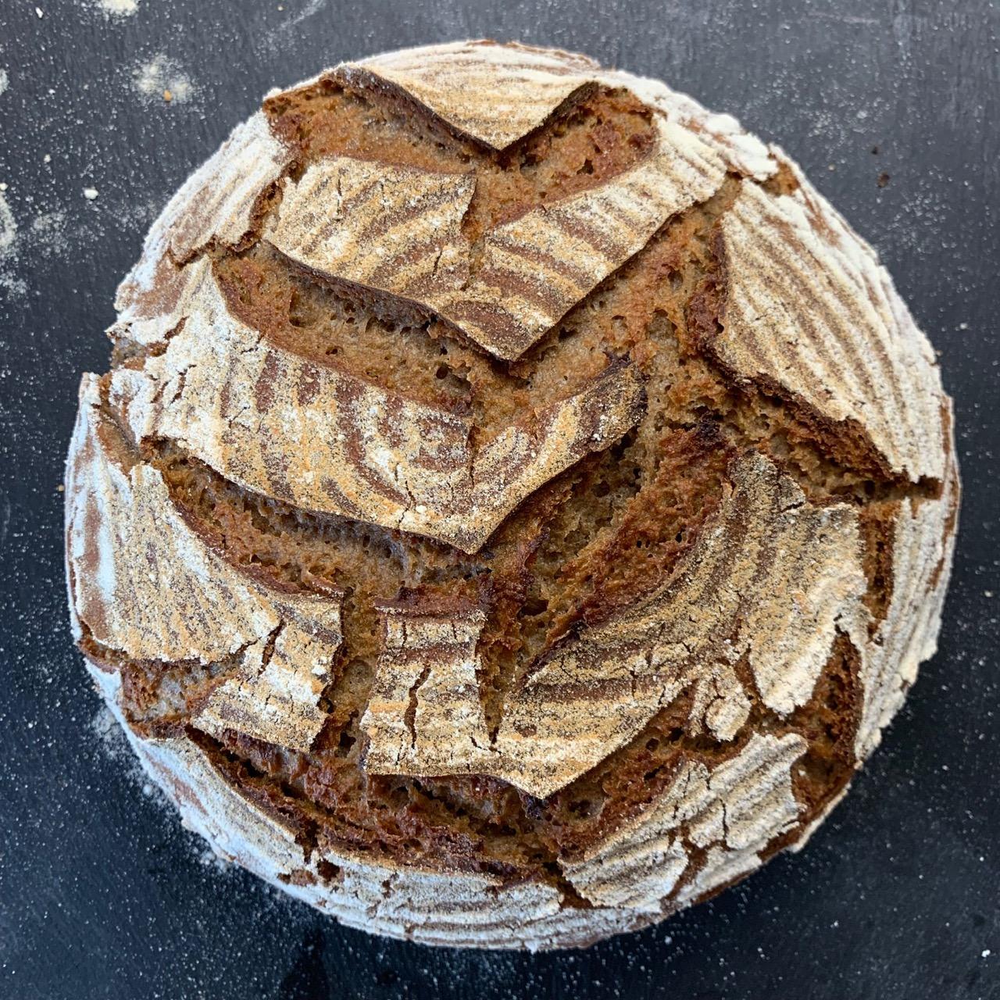
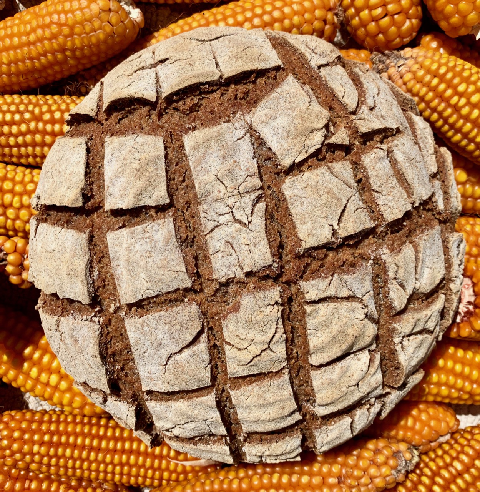
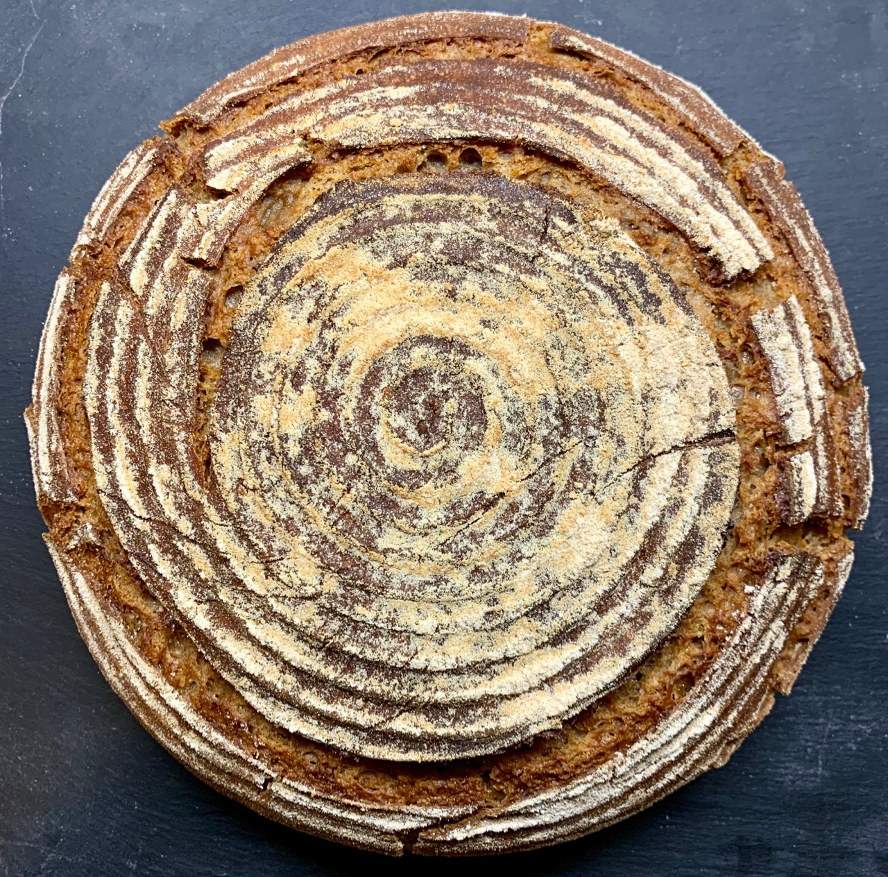

# German Mischbrot aka. Graubrot

Historically in Germans have eaten a lot of rye. Rye is more resistant to cold
and yields better crop with the German climate. Rye is planted in September/October
and then survives the winter. It can resist temperatures of up to -25°C.

Thus many German breads contain rye and also a little bit of wheat. Because
of that we call this bread `Mischbrot`. Which literally means mixture bread.
Depending on the area in Germany it is also known as `Graubrot`. Because the bread's crumb
is gray.

Rye adds a unique distinct taste to the bread. The combination with the wheat creates
an overall more open crumb. You could also leave out the wheat completely
but then would have a more dense crumb.

This is one of the easiest breads to bake as there is very little work required.

On top of that this recipe is excellent if you want to get rid of some discard
starter in your fridge or so. Just ramp up the sourdough with your discard starter.
The sourness plays really well with the wheat/rye combination. I sometimes go up
to 40% starter overall, having 20% active starter and 20% old discard starter.

## Ingredients
* 250 grams of rye flour (50%)
* 250 grams of wheat flour (50%)
* 100 grams of sourdough starter (20%)
* 325 grams of warm water (65%)
* 10 grams of salt (2%)

## Instructions
1. Mix all the ingredients together until you see that the flour has been nicely incorporated.

2. Place it in a covered bowl.

3. Let it ferment at room temperature for around 10 hours. In my case
the room has around 22°C. If it is colder, it might take longer.
If warmer, less time. Changing this variable will increase the sourness of the
final bread. This is personal preference. More sour bread will also have a
longer shelf life.

4. Flour the surface with a lot of flour.

5. Take the dough and place it on the flour

6. Try to form a little bit of a ball. Don't worry, it will not properly hold
   together. That's because of the corn flour and rye.

7. Place it in a rice-flowered banneton. Don't save on the flour. You do not
   want it to stick together.

8. Cover the banneton and place it in the fridge for 24 hours. My fridge has
   around 5°C.

9. We will be baking the bread in a dutch oven. You could also just place it
directly on a stone in the oven. Then you would need a tray of water in the
oven as water source though.

10. Flip the bread into pre-heated dutch oven, or on the stone.

12. Not required, but helping oven spring - score the bread with a sharp knife.
You can be creative about the scoring pattern. I like to do a swirl.

13. Bake for 25 minutes with lid covered and 20 minutes without the lid.
I bake at 230°C. Your oven might work differently. Wait until the crust has a
nice brown color.

13. Brush of any excess flour.

Wait 30 minutes before cutting. From experience the bread can survive 2 weeks
depending on how long you fermented the the dough.

