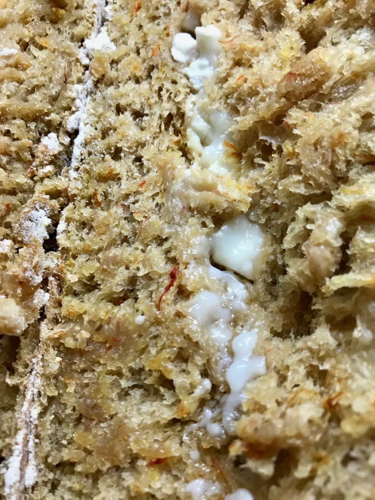
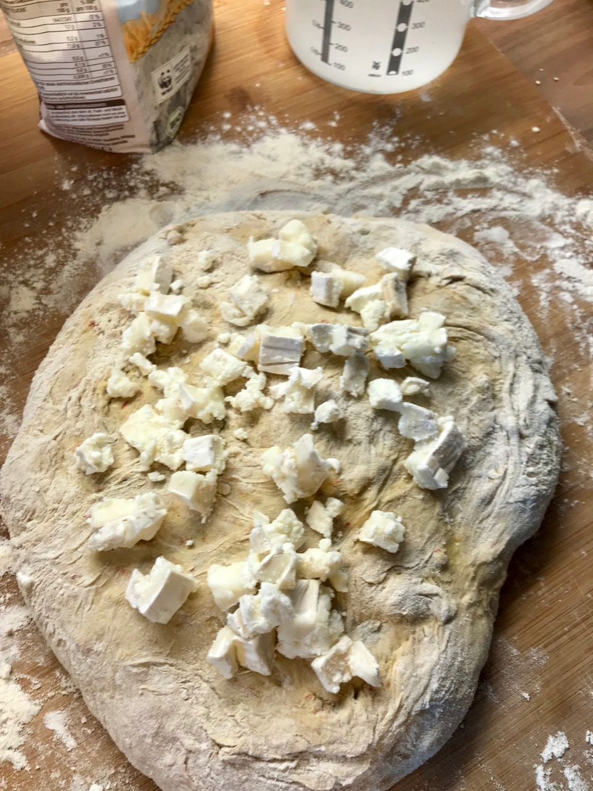

# Saffron Goat Cheese Bread

Goat cheese adds nice additional flavor to your bread. In combination with
with Saffron you end up having a Persian inspired yummy bread. The saffron
adds an interesting light red color to your final bake.

## Custom Ingredients

- 1 gram of Saffron.
- 100 grams of goat cheese. Do not mix in the dough initially.

### Recipe customization

Place the goat cheese evenly on top of the dough in front of you.

