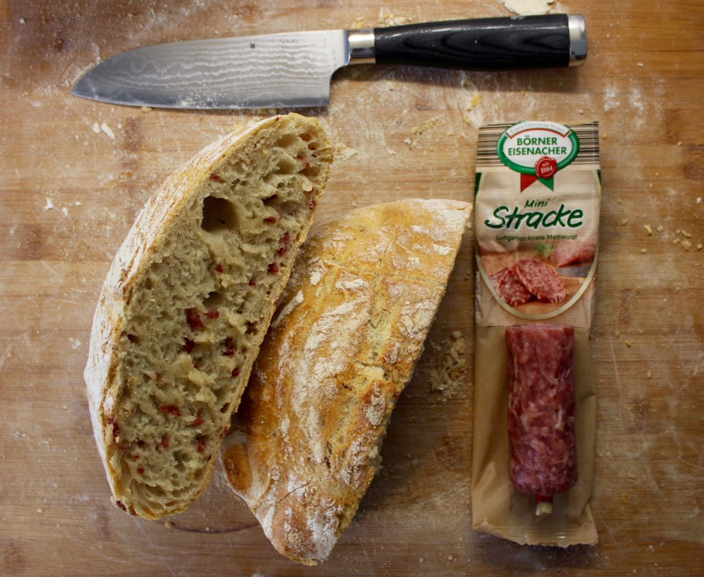

# Salami Bread

Salami adds an overall great flavor to your bread. The fat of the salami melts
during the bake. Thus the taste spreads all over your dough. It is as simple as adding
the Salami onto your dough before the final shape. This bread is ideal
standalone or as a starter for your barbecue.

## Custom Ingredients

- 100 grams of salami. Do not mix in the dough initially.

### Recipe customization

Cut the Salami into small cubic pieces and place the Salami evenly on top of
your dough.
