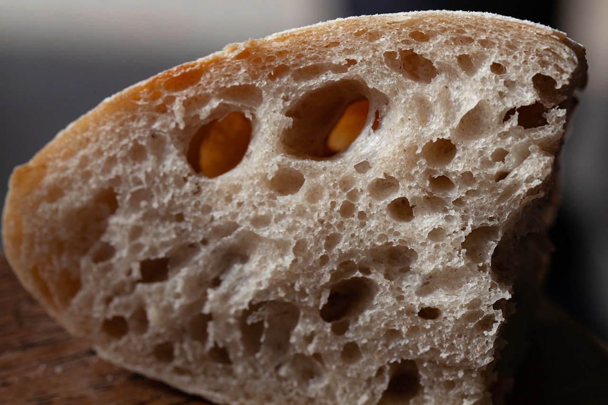

# Standard Bread

The standard white bread has no custom ingredients except flour, water, salt and yeast.
It has an excellent taste, is fluffy and at the same time crispy.
It's an excellent starter for various meals. Serving it with butter or olive oil
is recommended and creates an incredible taste experience.
It also combines nicely with dips or alongside the sauce of your main course.

If you want to start bread baking this recipe is the way to go. Try how
parameter changes influence your final bread. Change only one parameter at the
time. You might want to experience on the water amount you add, salt amount
and the baking time.

## Custom Ingredients

- None. See parent recipe.
