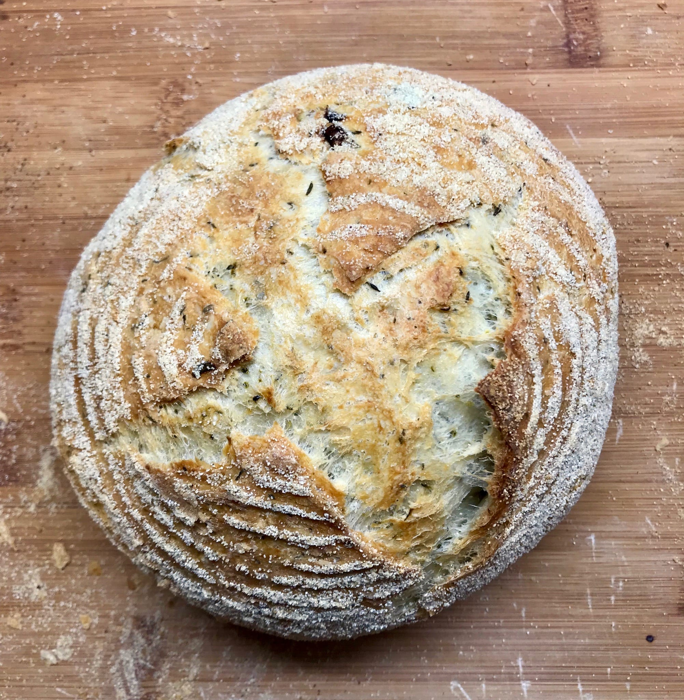
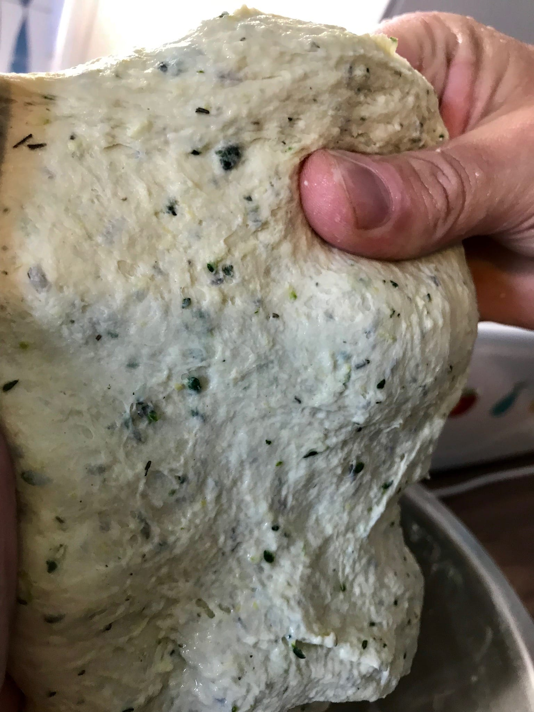
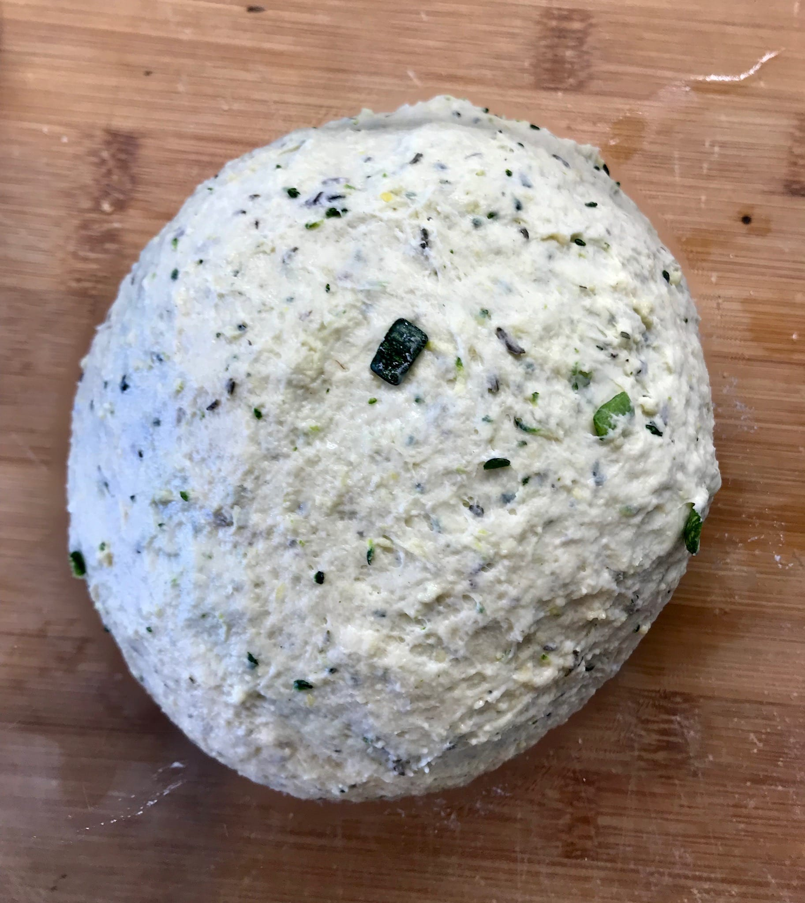
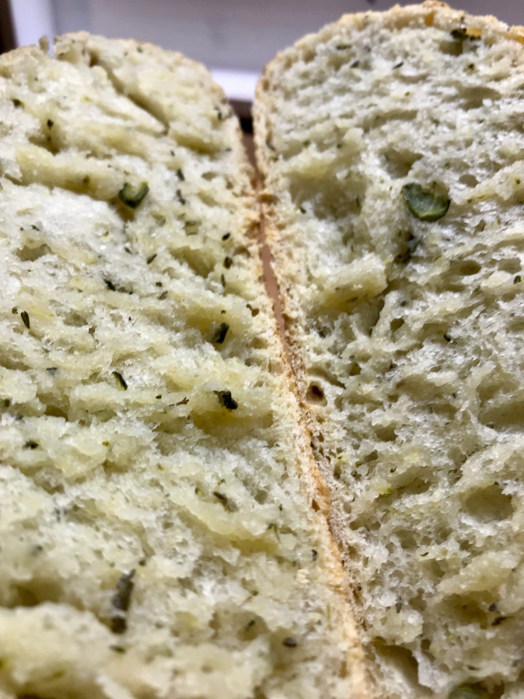

# Zucchini Bread

The zucchini bread makes use of the water in the zucchini instead of using tap
water to bake the bread. That way your final bread will have a very strong
zucchini taste. To extract the water we grind the zucchinis as
much as possible. When ground properly you will end up with [around 95% water.](http://healthyeating.sfgate.com/list-fruits-vegetable-high-water-content-8958.html).

This is a great variation of the regular bread. Especially since we use the
water from a source you would not expect: Zucchinis.

## Custom Ingredients

- We need 375 grams of water for the recipe. Zucchini has around 95% water.
  Which means we need 395 / 0.95 = ~ 395 grams of water. 95% of 395 is 375 grams.
  Only add the zucchini water not the default water.

### Pre steps

Grind the zucchini as much as possible. We want as much water as possible to
be released from the zucchini cells.

### Pictures

The dough already looks amazing with the green zucchini inside.

The gluten development is not as good as in the regular bread. The dough fehlt
a little bit like 85% hydration when working it.

When shaping the dough it felt a little more sticky than usual. Probably
because the zucchini reacts with the gluten and blocks them from forming.

Ultimately the final crumb. The bread was delicious. As you see there are not
that many big air holes. I guess that is because the zucchini blocks gluten
development slightly. Regardless the bread tasted amazing.

