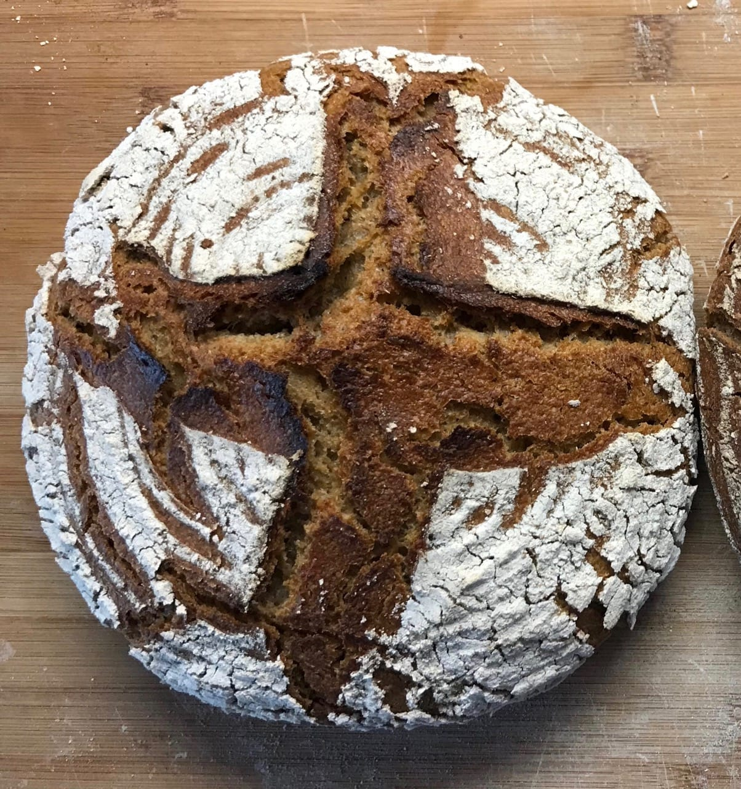
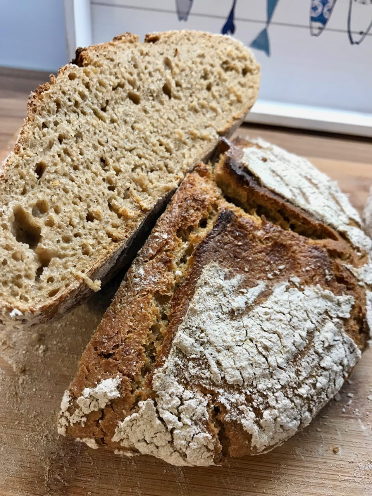
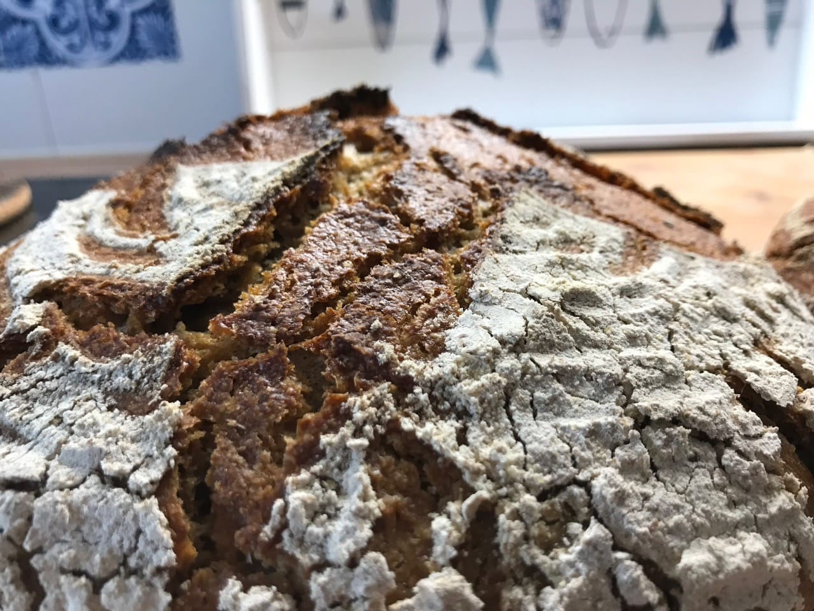

# Einkorn sourdough bread

Einkorn wheat was one of the first plants to be domesticated and cultivated.
The earliest clear evidence of the domestication of einkorn dates from 10,600
to 9,900 years before present. Remnants of einkorn were found with the iceman
mummy Ötzi, dated to 3100 BCE. Einkorn wheat is low-yielding but can survive
 on poor, dry, marginal soils where other varieties of wheat will not.

Einkorn has low gluten and thus will not rise as much in the oven as a
wheat bread would do. Since there is little Gluten there is also no
need to stretch and fold the dough. You mostly mix the ingredients and wait.

The taste of Einkorn is very similar to rye bread. Overall the taste is very good.
I like to bake with Einkorn because it books you back in the same situation
as our early ancestors.

## Custom Ingredients

- 500 grams of strong einkorn flour

### Custom Preparation steps

Instead of feeding our mother dough with wheat flour we will feed the mother
dough with einkorn flour. The mother dough will happily proceed and do its work
with einkorn as well. If you wanted a 100% einkorn starter you can simply create
another mother dough, feed it with einkorn instead of strong wheat flour.

Overall this is a nice addition to your daily bread baking. It is surely a really
ancient bread with lots of tradition.

