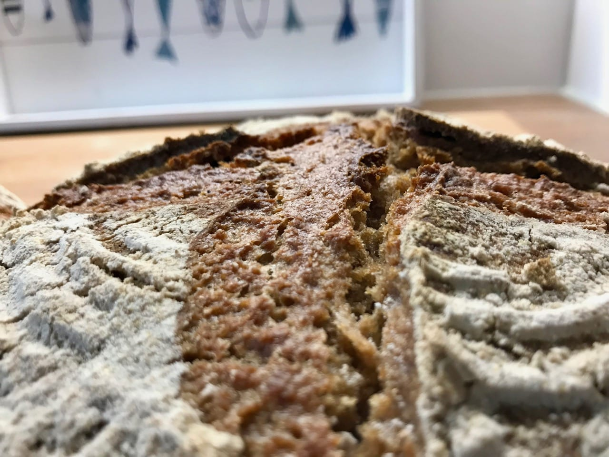

# Emmer sourdough bread

Emmer wheat, is also known as farro especially in Italy, or hulled wheat.
Along with einkorn wheat, emmer was one of the first crops domesticated
in the Near East. It was widely cultivated in the ancient world, but is
now a relict crop in mountainous regions of Europe and Asia.
Its value lies in its ability to give good yields on poor soils,
and its resistance to fungal diseases.

Emmer has low gluten and thus will not rise as much in the oven as a
wheat bread would do. Since there is little Gluten there is also no
need to stretch and fold the dough. You mostly mix the ingredients and wait.
Quite similar.

Emmer has a slightly nutty taste to it. From the color it looks very much like
a strong wheat/rye bread. Just like einkorn it feels really good to bake with
ancient grains.

## Custom Ingredients

- 500 grams of strong emmer flour

### Custom Preparation steps

Instead of feeding our mother dough with wheat flour we will feed the mother
dough with emmer flour. The mother dough will happily proceed and do its work
with emmer as well. If you wanted a 100% emmer starter you can simply create
another mother dough, feed it with emmer instead of strong wheat flour.

Overall this is a nice addition to your daily bread baking. It is surely a really
ancient bread with lots of tradition.

