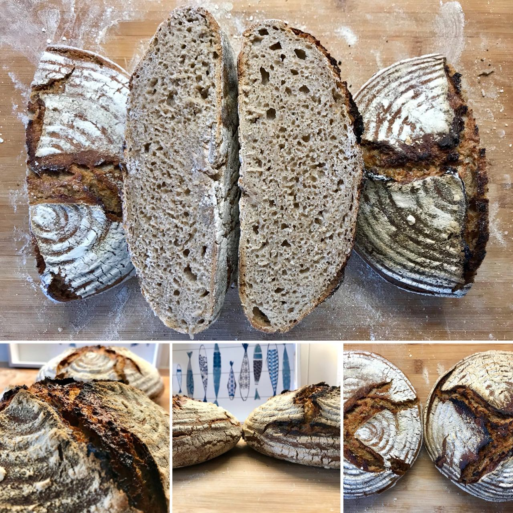
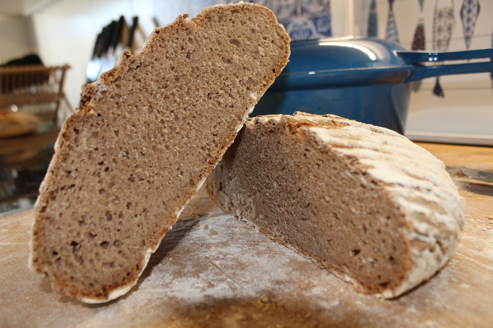
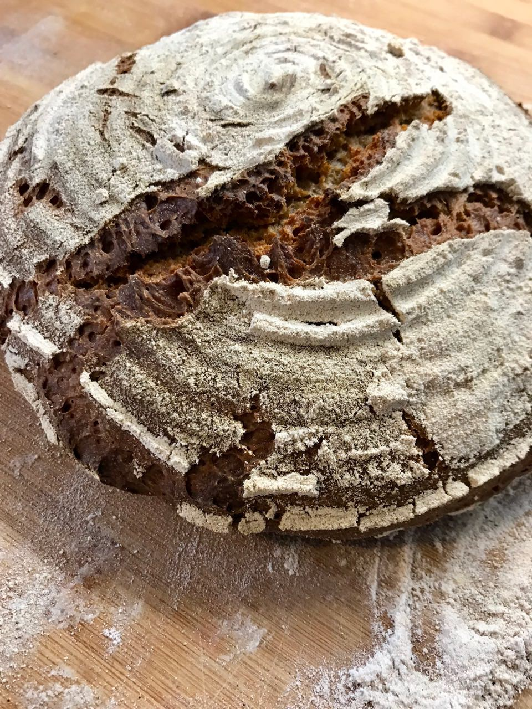
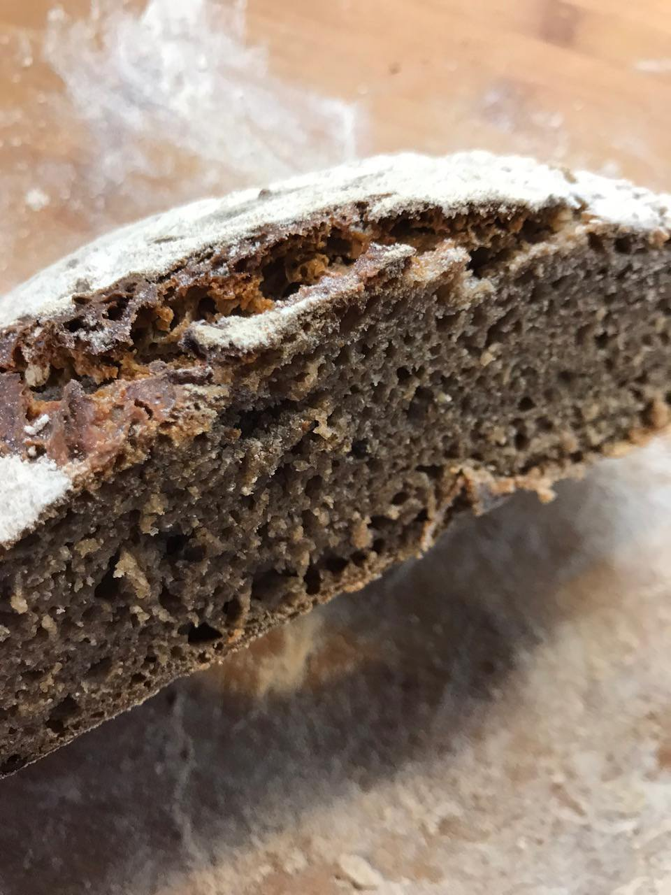

# Golden Standard German Bread

If you come to Germany you need to experience this bread.
For ages the Germans have baked bread with sourdough and rye.
Traditionally rye has been used because it can already be planted
starting September in the year before. It is able to survive the freezing
temperatures of the winter. During early summer the crop can already be
harvested and used.

This the standard German bread because it is the most common one in Germany.
If you talk to Germans and they talk about German bread it is usually a
variation of this bread. When traveling to other countries I did not see
a place yet where bread like this was popular.

The final bread you bake will have a somewhat grayish color on the inside.
That is why it is also called *gray bread* in Germany. In the picture above
you can see a comparison of two rye breads. The left one has 80% rye and 20%
wheat and the right one 100% rye. Notice how the right bread looks slightly
darker from the inside than the left one. 100% rye breads are more popular in the
south of Germany. Thus most people know usually a 50% wheat 50% rye
combination. Many prefer a more ryeish taste with 80% rye, 20% wheat. This is
what we will be baking in this recipe.

Please note that this is a quite difficult bread to bake. Reason being that
rye behaves completely different than wheat. Rye has different proteins which
do not stick together as much as in wheat. At the same type rye has special
sugars known as "Pentosans". They stick to the gluten of the dough blocking
the glutens from sticking together. Thus the dough becomes much more sticky
than regular wheat bread. Use more water on your hands when working the dough.
At the same time flour the surface more then you would when baking wheat
bread. Because of this the rye bread is usually never as fluffy on the inside
as the wheat bread. However you will be surprised how excellent and unique
this bread tastes.

## Custom Ingredients

- 400 grams of strong rye flour or full-grain rye flour.
- 100 grams of strong wheat flour or full-grain wheat flour.

### Custom Preparation steps

Instead of feeding our mother dough with wheat flour we will feed the mother
dough with rye flour. The mother dough will happily proceed and do its work
with rye as well. Note in the final bake you might not have 80% rye, 20%
wheat. This is because your mother dough might currently mostly consist of
wheat flour. Do not worry about this. If you would like to have an even
rye-isher taste, you can decrease the strong wheat flour and increase the rye
percentage.

This is how my first ever baked 80% rye bread looked like:

This is how it looked like from the inside.

If you compare this with other recipes you will notice that the inside does
not have similar air bubbles. This is because of the rye blocking gluten
development.

You might also want to consider baking a [100% Bavarian rye bread.](/recipes/sourdough/bavarian-rye-bread.md)
Bake two of them and test which one you prefer.
