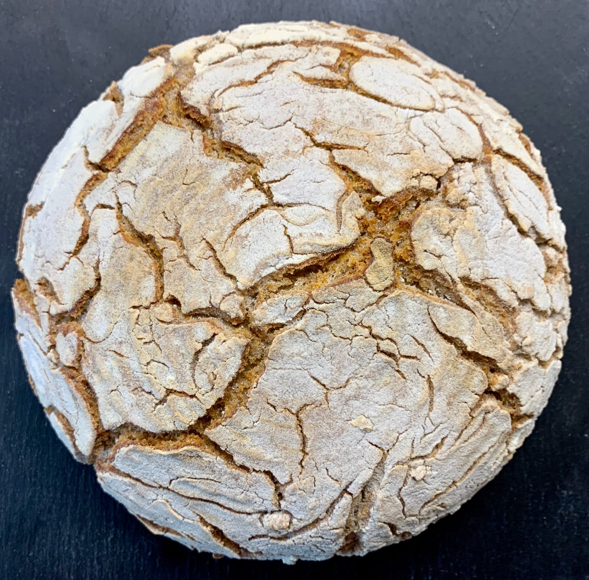
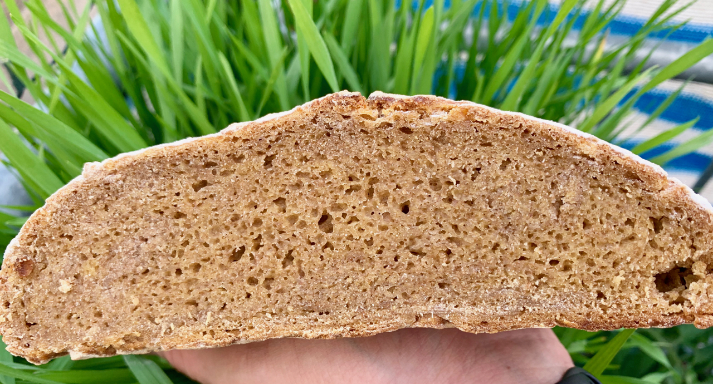
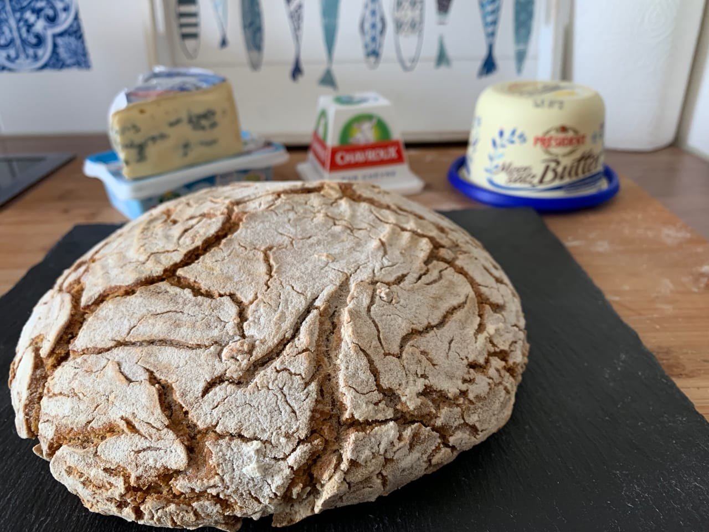
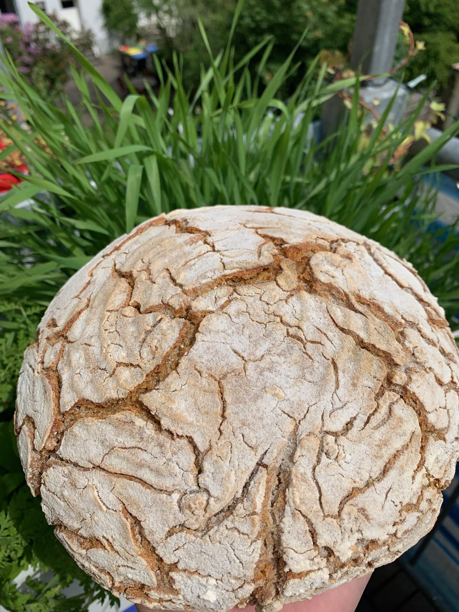

# Portuguese inspired Broa Corn Bread

Broa is a type of corn and rye/wheat bread traditionally made in Portugal,
Galicia, Angola, Mozambique, Cape Verde, and Brazil. Unlike the cornbread
typical of the southern United States, broa is made from a mixture of
cornmeal and rye or wheat flour.

When baking with corn you need to deploy different strategies.
Corn flour, for instance, has no gluten.  As a consequence the whole dough
will not stick together as nicely as regular wheat dough.
At the same time the bread is a little denser, as not as
much air can be trapped inside of the dough when baking.

## Ingredients
* 200 grams of rye flour (50%)
* 200 grams of corn flour (50%)
* 80 grams of sourdough starter (20%)
* 280 grams of warm water (70%)
* 8 grams of salt (2%)

## Instructions
1. Mix all the ingredients together until you see that the flour has been nicely incorporated.

2. Place it in a covered bowl.

3. Let it ferment at room temperature for around 10 hours. In my case
the room has around 22°C. If it is colder, it might take longer.
If warmer, less time. Changing this variable will increase the sourness of the
final bread. This is personal preference. More sour bread will also have a
longer shelf life.

4. Flour the surface with a lot of flour.

5. Take the dough and place it on the flour

6. Try to form a little bit of a ball. Don't worry, it will not properly hold
   together. That's because of the corn flour and rye.

7. Place it in a rice-flowered banneton. Don't save on the flour. You do not
   want it to stick together.

8. Cover the banneton and place it in the fridge for 24 hours. My fridge has
   around 5°C.

9. We will be baking the bread in a dutch oven. You could also just place it
directly on a stone in the oven. Then you would need a tray of water in the
oven as water source though.

10. Flip the bread into pre-heated dutch oven, or on the stone.

11. Bake for 25 minutes with lid covered and 20 minutes without the lid.
I bake at 230°C. Your oven might work differently. Wait until the crust has a
nice brown color.

12. Brush of any excess flour.

Wait 30 minutes before cutting. From experience the bread can survive 2 weeks
depending on how long you fermented the the dough.

