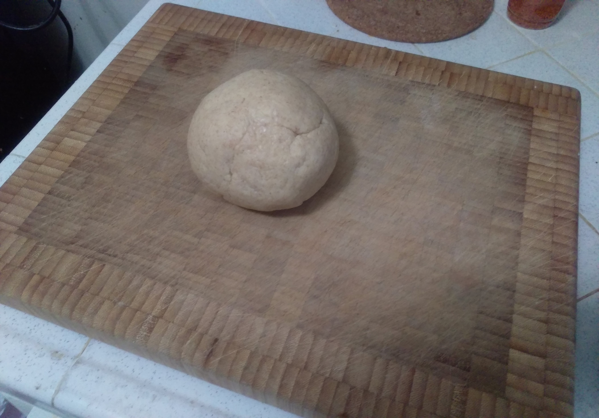
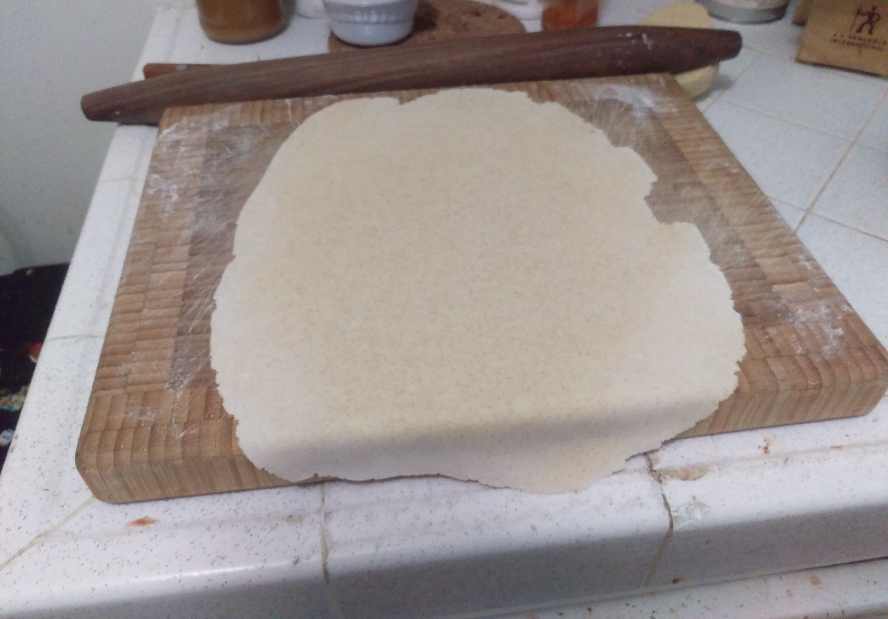
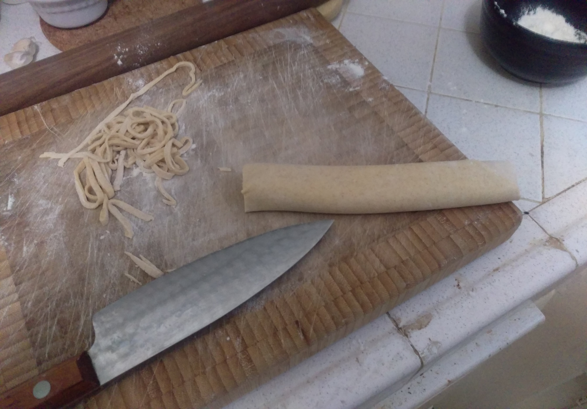
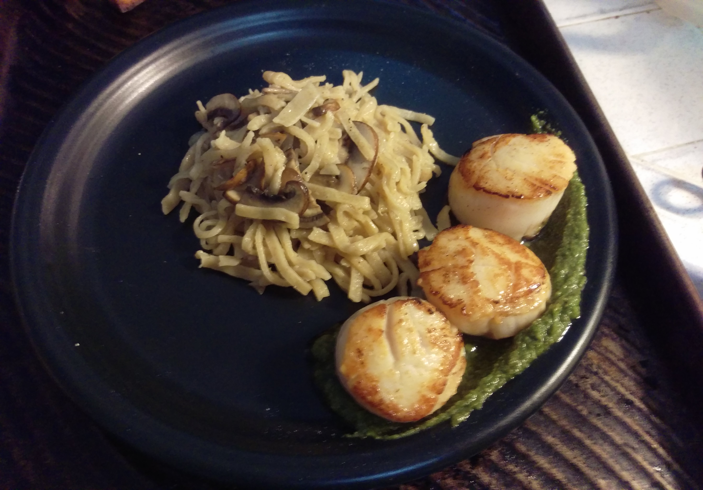

# Sourdough Pasta

You should be familiar with cooking, seasoning, finishing (and perhaps even plating) 
store-bought pasta before beginning this recipe.  You should also have at least 200g
sourdough starter on hand.

This recipe is designed to consume excess sourdough starter as you find
it readily available.  It can be made 24 hours in advance or it can be completed in around
2 hours for lunch or dinner.  This pasta can be dried and stored for up to a year.

### Ratios
75% Semolina flour.
25% sourdough starter
42% hydration

### Sample recipe
Here we will shape our pasta into traditional noodles, however other
shapes such as Trofie, Orecchiette or garganelli can also be used.

a pasta serving is roughly 56g per person.
this recipe serves 4 people:

250g batch:
188g semolina flour. other flours may be substituted.
125g Sourdough starter.  
42.5g water.

Knead to combine for 15 minutes. 
cover and rest for 1 hour in the refrigerator.
remove from refrigerator and roll onto a semolina dusted 
cutting board into a large sheet.  Once your desired pasta
thickness is achieved, dust the pasta again and roll
the dough into a tube.  Slice the dough in 2-5mm widths.  Once complete, 
carefully unfurl the pasta and toss again in a light dusting
of semolina.  

### cooking
bring 2 litres of water to a rolling boil.  add fresh pasta and
boil for 2-3 minutes, or add dried pasta and boil for 6-11 minutes.
total time depends on the width and thickness of your pasta, so you 
may find you need to practice.

### Drying
hang the pasta in a cool dry space with good ventilation over a rope,
string, or traditionally over a broom handle.

### Bonus
this recipe can also be used to make sourdough dumpling wrappers.
simply fold the dough in half as opposed to thirds, and slice into
triangles or squares.  

### ratio clarification
Did it seem like we used a lot of sourdough and not a lot of water?
this is because our sourdough starter is being measured by the weight
of its constituents, not its final combined mass.  125g of starter is 62.5g
of flour after all.  62.5g of water has therefore also been discounted from the 
doughs final hydration of 42% calculated against 250g.
