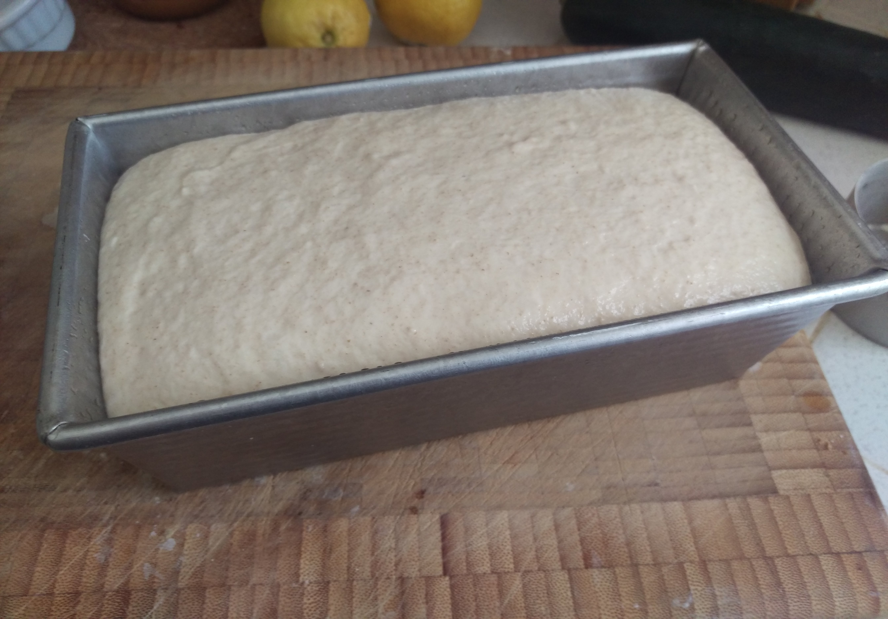

# Sandwich Sourdough loaf

some bakers may find the sourdough "boule" shape impractical for sandwich making,
or that forming/shaping/bench rest take too much time.  This recipe produces a sandwich loaf
of uniform dimension in a standard loaf pan and requires no forming or shaping.  it is perfect
for pre-made sandwiches for lunch at work, or for school lunches.

as this bread is baked in a pan at lower hydration it sacrifices some rise.  
it may also sacrifice deeper colouration. 

## Recipe:
 for a 500g loaf, produce
* 200g leaven
* 300g white flour
* 65% hydration based on water discount from the leaven.
* 1.2% salt.

### Leaven and autolyse
Form the leaven the night before the bake.
8 hours later, the morning of the bake, incorporate the leaven, flour
and remaining water and mix to combine.  Allow to rest for 30 minutes covered.

### Form the gluten

We will not be in attendance for regular stretch and folds, as such you will need 
to dedicate 15-20 minutes for a legitimate knead of this dough to develop proper 
initial gluten structure and ensure a successful rise.  Incorporate the salt at this time
and work into the dough.  once completed, loosely form
the dough into a rectangular shape and place in an oiled loaf pan.

### The all-rise

The loaf will complete any and all rising in the pan.  as such it is important you select a
reputable nonstick pan.  The rise will take 8-12 hours total depending on the weather, so its
convenient to leave this bread wrapped in a plastic bag for the day while at work or school.

### Baking

After 8 hours this loaf should appear a giant puddle, but dont worry.  score the loaf along the top 
and Bake at 400f/200c for 45 minutes.  Do not exceed 450, as this is the limit at which most
non-stick applications begin to chemically degrade into foods.  The loaf will rise and pull away from
the sides of the pan as it bakes.

### Troubleshooting

- Loaf doesnt rise to crest the pan

  since loaf pans dont appear to be metric/ISO, you may need to increase the amount of dough you use.

- Loaf cracks off-center along the side

  You must score the loaf 1-2 cm down the center to encourage proper rise.  

- Rise is paltry

  Dry climates may require spraying the top of the loaf or oven walls with water. this will also improve colouration.

  
