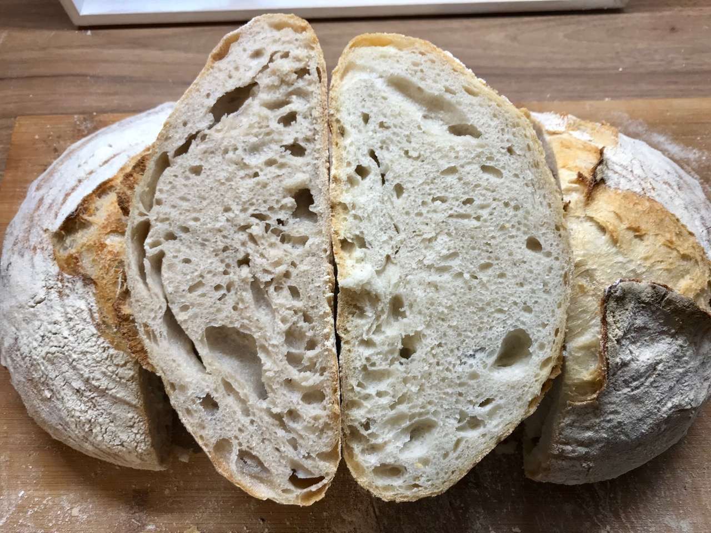
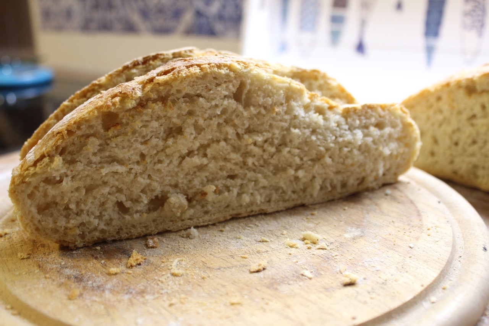

# Standard Sourdough Bread

This is similar to the standard yeast bread just with sourdough. It is the
most basic sourdough bread that you can make.

It has an excellent taste, is fluffy and at the same time crispy.
It's an excellent starter for various meals. Serving it with butter or
olive oil is recommended and creates an incredible taste experience.
It also combines nicely with dips or alongside the sauce of your main course.

In comparison to the yeast version the sourness adds a nice amount of flavour to your bread.

Master this sour dough recipe before moving on to more complex sourdough
recipes.

## Custom Ingredients

- None. See parent recipe.

### Form the gluten

Instead of just letting the dough rest for for hours we will be performing
strech and folds every 1 hour. Follow the practice described in the [basic
dough recipe](/basics/basic-dough.md#stretch-and-fold-part-1). That way the
gluten structure will become even better. The stretch and fold does not work
for all flours, that's why it is not done by default on all sourdoughs you
bake.

Do not worry if you will not be able to do the stretch and fold. Based on
experience this resulted in a 10% higher raise in the oven. It is not a must.
It's a nice addon to make your bread even nicer. I never let this part dictate
my day though. If I have time I do it, if not I do not.

All the other steps are inherited from the basic sour dough.

This is how my first ever sour dough bread looked like. The one shown at the
top of this article is probably my 50th sourdough bread or so. Keep iterating
and adjusting your parameters. Happy baking!

