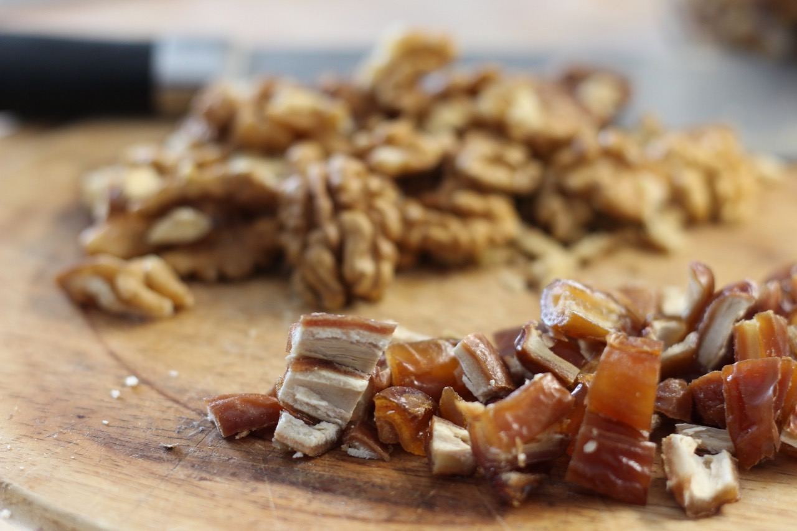

# Date Walnut Bread

The date walnut bread is an exquisite bread with an amazing taste.
You initially taste the dates and then have walnutty taste afterwards.
I never put any toppings on the bread as it tastes great on its own.
The dates seem to cause the bread to become slightly darker in its color. Thus
the bread looks really excellent and rustic.

Interestingly the dates lose sweetness in this bread. Over the the yeast
converts much of the sugar to gas. You will have a nice date taste, not too
sweet.

## Custom Ingredients

- 100 grams of walnuts
- 100 grams of dates

### Recipe Customization

Cut the dates and walnuts into small pieces. I like to put the walnuts into a plastic bag and crush them with a hammer. Place the ingredients on the dough in front of you.
