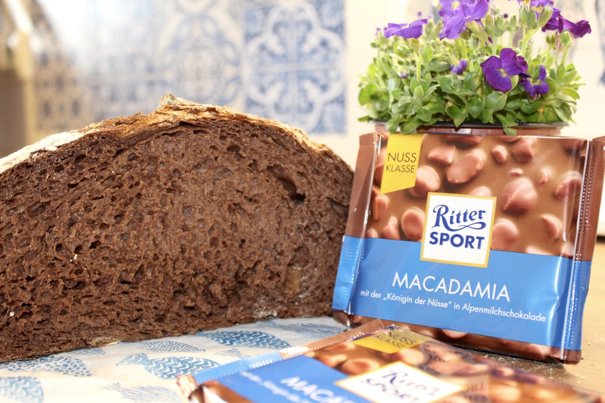
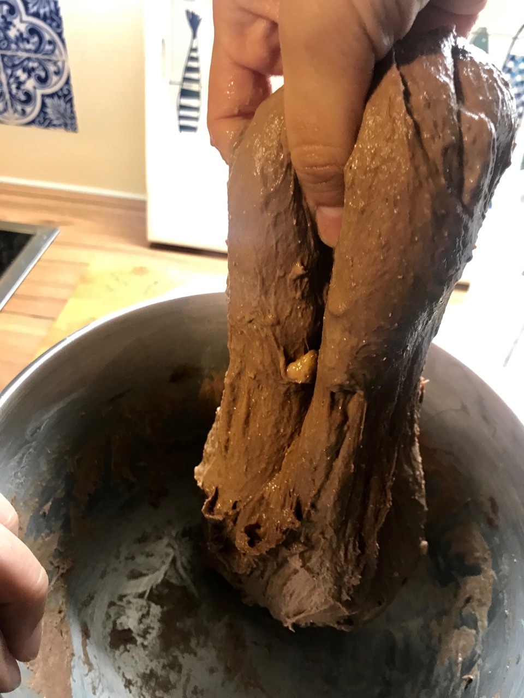
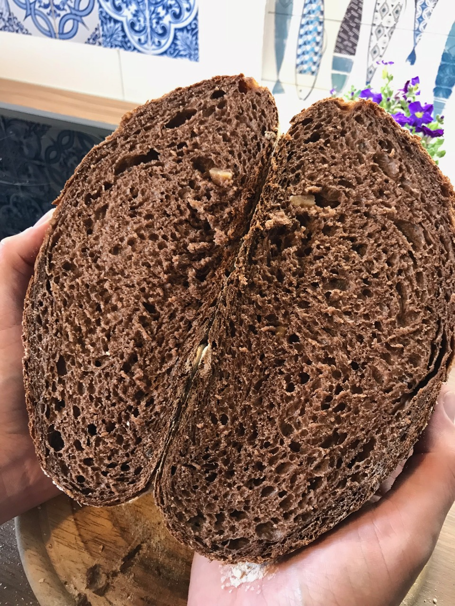

# Full Milk Chocolate Bread

If you love chocolate and bread, you will enjoy this recipe. This bread is
excellent as a sweet starter or as a bread alongiside your desert. The crumb
is extremly fluffy. Because of the chocolate the yeast has sugar which can be
converted into gas. The gas stays inside the bread and thus makes it so
fluffy.

Interestingly the overall bread does not taste as sweet as you might expect.
Reason being that the yeast is quite quick in converting the sugars into gas.
The faster you bake the bread the sweeter it will taste.

You can pick any chocolate you like to bake this bread.

## Custom Ingredients

- 100 grams of full milk chocolate
- Use cold water instead of warm water. The chocolate you add will be hot. This way we do not damage the yeast

### Pre steps

Melt the chocolate completely in large bowl. Stir the chocolate frequently so
that it will not burn.

